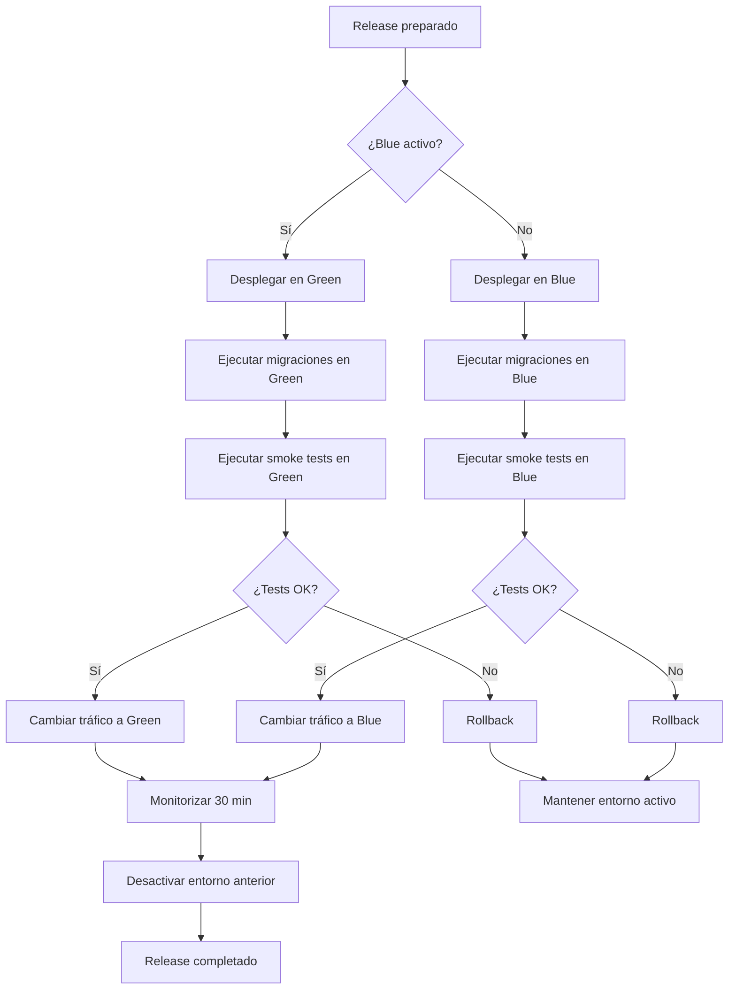

# DOCUMENTO 11: PLAN DE DESPLIEGUE
## XMedical - Sistema de Gestión Clínica Multi-tenant para Primer y Segundo Nivel

| Versión | Fecha | Autor | Estado |
|---------|-------|-------|--------|
| 1.0 | 2026 | Agente de Documentación Técnica | **Aprobado** |

---

## 1. VISIÓN GENERAL

Este documento define el **plan de despliegue** de XMedical, incluyendo:

- **Estrategia de despliegue** (entornos, CI/CD, rollback)
- **Requisitos de infraestructura**
- **Procedimientos de instalación** (cloud y on-premise)
- **Configuración de servicios**
- **Verificación post-despliegue**
- **Plan de contingencia**

---

## 2. ESTRATEGIA DE DESPLIEGUE

### 2.1 Entornos

```
┌─────────────────────────────────────────────────────────────────────────────────────┐
│                              ENTORNOS DE XMEDICAL                                     │
├─────────────────────────────────────────────────────────────────────────────────────┤
│                                                                                      │
│   ┌──────────────┐    ┌──────────────┐    ┌──────────────┐    ┌──────────────┐     │
│   │ DESARROLLO   │───►│  INTEGRACIÓN │───►│   STAGING    │───►│ PRODUCCIÓN   │     │
│   │   (dev)      │    │    (ci)      │    │   (staging)  │    │   (prod)     │     │
│   └──────────────┘    └──────────────┘    └──────────────┘    └──────────────┘     │
│         │                    │                    │                    │           │
│         ▼                    ▼                    ▼                    ▼           │
│   ┌──────────────┐    ┌──────────────┐    ┌──────────────┐    ┌──────────────┐     │
│   │ Datos        │    │ Datos        │    │ Datos        │    │ Datos        │     │
│   │ sintéticos   │    │ sintéticos   │    │ anonimizados │    │ reales       │     │
│   └──────────────┘    └──────────────┘    └──────────────┘    └──────────────┘     │
│                                                                                      │
│   Características:                                                                    │
│   • Desarrollo: código más reciente, pruebas unitarias                               │
│   • Integración: CI/CD automático, pruebas de integración                           │
│   • Staging: pre-release, UAT, pruebas de rendimiento                                │
│   • Producción: sistema real, monitoreo activo                                       │
│                                                                                      │
└─────────────────────────────────────────────────────────────────────────────────────┘
```

### 2.2 Estrategia de despliegue (Blue-Green)



### 2.3 Pipeline CI/CD (GitHub Actions)

```yaml
# .github/workflows/deploy.yml
name: Deploy XMedical

on:
  push:
    branches: [main, staging]
  pull_request:
    branches: [main]

env:
  PYTHON_VERSION: '3.11'
  DJANGO_SETTINGS_MODULE: 'xmedical.settings.production'

jobs:
  test:
    runs-on: ubuntu-latest
    steps:
      - uses: actions/checkout@v3
      
      - name: Setup Python
        uses: actions/setup-python@v4
        with:
          python-version: ${{ env.PYTHON_VERSION }}
      
      - name: Install dependencies
        run: |
          pip install -r requirements.txt
          pip install -r requirements-dev.txt
      
      - name: Run linting
        run: |
          flake8 apps/
          black --check apps/
      
      - name: Run unit tests
        run: pytest tests/unit --cov=apps --cov-report=xml
      
      - name: Run integration tests
        run: pytest tests/integration
      
      - name: Run security scan
        run: bandit -r apps/ -ll
      
      - name: Upload coverage
        uses: codecov/codecov-action@v3

  build:
    needs: test
    runs-on: ubuntu-latest
    if: github.ref == 'refs/heads/main'
    
    steps:
      - uses: actions/checkout@v3
      
      - name: Build Docker image
        run: |
          docker build -t xmedical:${{ github.sha }} .
          docker tag xmedical:${{ github.sha }} xmedical:latest
      
      - name: Push to registry
        run: |
          echo ${{ secrets.DOCKER_PASSWORD }} | docker login -u ${{ secrets.DOCKER_USERNAME }} --password-stdin
          docker push xmedical:${{ github.sha }}
          docker push xmedical:latest

  deploy-staging:
    needs: build
    runs-on: ubuntu-latest
    environment: staging
    if: github.ref == 'refs/heads/main'
    
    steps:
      - name: Deploy to staging
        run: |
          ssh staging-server "cd /opt/xmedical && \
            docker pull xmedical:latest && \
            docker-compose down && \
            docker-compose up -d && \
            docker-compose exec web python manage.py migrate"
      
      - name: Run smoke tests
        run: |
          curl -f https://staging.xmedical.com/health/
          curl -f https://staging.xmedical.com/api/v1/health/

  deploy-production:
    needs: deploy-staging
    runs-on: ubuntu-latest
    environment: production
    if: github.ref == 'refs/heads/main'
    
    steps:
      - name: Deploy to production (Blue-Green)
        run: |
          ssh prod-server "cd /opt/xmedical && \
            docker pull xmedical:latest && \
            docker-compose -f docker-compose.blue.yml up -d && \
            sleep 30 && \
            curl -f https://blue.xmedical.com/health/ && \
            docker-compose -f docker-compose.blue.yml exec web python manage.py migrate && \
            # Switch traffic
            sudo systemctl reload nginx && \
            docker-compose -f docker-compose.green.yml down"
```

---

## 3. REQUISITOS DE INFRAESTRUCTURA

### 3.1 Requisitos mínimos (MVP - 1 tenant)

| Recurso | Mínimo | Recomendado | Cloud (AWS) |
|---------|--------|-------------|-------------|
| **CPU** | 2 vCPU | 4 vCPU | t3.medium |
| **RAM** | 4 GB | 8 GB | t3.medium (4GB) / t3.large (8GB) |
| **Disco** | 50 GB SSD | 100 GB SSD | gp3 (100GB) |
| **Sistema** | Ubuntu 22.04 LTS | Ubuntu 22.04 LTS | AMI Ubuntu |
| **PostgreSQL** | 15+ | 15+ | RDS db.t3.micro |
| **Redis** | 6+ | 6+ | ElasticCache t3.micro |

### 3.2 Requisitos escalados (10+ tenants)

| Recurso | Mínimo | Recomendado | Cloud (AWS) |
|---------|--------|-------------|-------------|
| **CPU** | 4 vCPU | 8 vCPU | m5.large / m5.xlarge |
| **RAM** | 16 GB | 32 GB | m5.large (16GB) / m5.xlarge (32GB) |
| **Disco** | 200 GB SSD | 500 GB SSD | gp3 (500GB) |
| **PostgreSQL** | db.t3.large | db.m5.large | RDS (multi-AZ) |
| **Redis** | cache.t3.medium | cache.m5.large | ElasticCache |

---

## 4. PROCEDIMIENTOS DE INSTALACIÓN

### 4.1 Instalación en Cloud (AWS - Recomendado)

```bash
#!/bin/bash
# deploy_aws.sh - Despliegue automatizado en AWS

# 1. Crear instancia EC2
aws ec2 run-instances \
    --image-id ami-0c7217b8b1a6e6b2c \
    --instance-type t3.medium \
    --key-name xmedical-key \
    --security-group-ids sg-12345678 \
    --user-data file://user-data.sh

# 2. Configurar RDS (PostgreSQL)
aws rds create-db-instance \
    --db-instance-identifier xmedical-db \
    --db-instance-class db.t3.micro \
    --engine postgres \
    --engine-version 15.3 \
    --master-username xmedical_admin \
    --master-user-password $DB_PASSWORD \
    --allocated-storage 100 \
    --storage-type gp3

# 3. Configurar ElastiCache (Redis)
aws elasticache create-cache-cluster \
    --cache-cluster-id xmedical-redis \
    --cache-node-type cache.t3.micro \
    --engine redis \
    --num-cache-nodes 1

# 4. Configurar S3 (Storage)
aws s3 mb s3://xmedical-storage --region us-east-1
aws s3api put-bucket-versioning --bucket xmedical-storage --versioning-configuration Status=Enabled
```

### 4.2 Instalación con Docker Compose (On-Premise)

```yaml
# docker-compose.yml
version: '3.8'

services:
  postgres:
    image: postgres:15
    container_name: xmedical_postgres
    environment:
      POSTGRES_DB: xmedical
      POSTGRES_USER: xmedical_user
      POSTGRES_PASSWORD: ${DB_PASSWORD}
    volumes:
      - postgres_data:/var/lib/postgresql/data
    ports:
      - "5432:5432"
    healthcheck:
      test: ["CMD-SHELL", "pg_isready -U xmedical_user"]
      interval: 10s
      timeout: 5s
      retries: 5

  redis:
    image: redis:7-alpine
    container_name: xmedical_redis
    ports:
      - "6379:6379"
    volumes:
      - redis_data:/data
    command: redis-server --appendonly yes

  web:
    build: .
    container_name: xmedical_web
    command: >
      sh -c "python manage.py migrate &&
             python manage.py collectstatic --noinput &&
             gunicorn xmedical.wsgi:application --bind 0.0.0.0:8000"
    environment:
      DJANGO_SETTINGS_MODULE: xmedical.settings.production
      DB_NAME: xmedical
      DB_USER: xmedical_user
      DB_PASSWORD: ${DB_PASSWORD}
      DB_HOST: postgres
      DB_PORT: 5432
      REDIS_URL: redis://redis:6379/0
      SECRET_KEY: ${SECRET_KEY}
    volumes:
      - static_volume:/app/static
      - media_volume:/app/media
    depends_on:
      postgres:
        condition: service_healthy
      redis:
        condition: service_started
    ports:
      - "8000:8000"

  nginx:
    image: nginx:alpine
    container_name: xmedical_nginx
    volumes:
      - ./nginx/nginx.conf:/etc/nginx/conf.d/default.conf
      - static_volume:/static
      - media_volume:/media
    ports:
      - "80:80"
      - "443:443"
    depends_on:
      - web

  celery:
    build: .
    container_name: xmedical_celery
    command: celery -A xmedical worker -l info
    environment:
      DJANGO_SETTINGS_MODULE: xmedical.settings.production
      DB_NAME: xmedical
      DB_USER: xmedical_user
      DB_PASSWORD: ${DB_PASSWORD}
      DB_HOST: postgres
      REDIS_URL: redis://redis:6379/0
    depends_on:
      - postgres
      - redis

  celery-beat:
    build: .
    container_name: xmedical_celery_beat
    command: celery -A xmedical beat -l info
    environment:
      DJANGO_SETTINGS_MODULE: xmedical.settings.production
      REDIS_URL: redis://redis:6379/0
    depends_on:
      - redis

volumes:
  postgres_data:
  redis_data:
  static_volume:
  media_volume:
```

### 4.3 Configuración de Nginx

```nginx
# nginx/nginx.conf
server {
    listen 80;
    server_name ~^(?<tenant>.+)\.xmedical\.com$ xmedical.com;
    
    location / {
        return 301 https://$server_name$request_uri;
    }
}

server {
    listen 443 ssl http2;
    server_name ~^(?<tenant>.+)\.xmedical\.com$ xmedical.com;
    
    ssl_certificate /etc/nginx/ssl/fullchain.pem;
    ssl_certificate_key /etc/nginx/ssl/privkey.pem;
    
    # Multi-tenant header
    proxy_set_header X-Tenant-Id $tenant;
    
    location /static/ {
        alias /static/;
    }
    
    location /media/ {
        alias /media/;
    }
    
    location / {
        proxy_pass http://web:8000;
        proxy_set_header Host $host;
        proxy_set_header X-Real-IP $remote_addr;
        proxy_set_header X-Forwarded-For $proxy_add_x_forwarded_for;
        proxy_set_header X-Forwarded-Proto $scheme;
    }
}
```

---

## 5. CONFIGURACIÓN DE SERVICIOS

### 5.1 Variables de entorno

```bash
# .env.production
# Django
SECRET_KEY=clave_super_secreta_cambiar_en_produccion
DEBUG=False
ALLOWED_HOSTS=xmedical.com,*.xmedical.com

# Database
DB_NAME=xmedical
DB_USER=xmedical_user
DB_PASSWORD=contraseña_segura
DB_HOST=localhost
DB_PORT=5432

# Redis
REDIS_URL=redis://localhost:6379/0

# Email
EMAIL_HOST=smtp.sendgrid.net
EMAIL_PORT=587
EMAIL_HOST_USER=apikey
EMAIL_HOST_PASSWORD=sendgrid_api_key

# AWS (opcional)
AWS_ACCESS_KEY_ID=ak...
AWS_SECRET_ACCESS_KEY=sk...
AWS_STORAGE_BUCKET_NAME=xmedical-storage

# IA APIs
OPENAI_API_KEY=sk...
GOOGLE_VISION_API_KEY=ak...
```

### 5.2 Configuración de Gunicorn

```bash
# gunicorn.conf.py
import multiprocessing

bind = "0.0.0.0:8000"
workers = multiprocessing.cpu_count() * 2 + 1
worker_class = "sync"
worker_connections = 1000
timeout = 120
keepalive = 5
accesslog = "/var/log/gunicorn/access.log"
errorlog = "/var/log/gunicorn/error.log"
loglevel = "info"
```

### 5.3 Configuración de Celery

```python
# xmedical/celery.py
import os
from celery import Celery

os.environ.setdefault('DJANGO_SETTINGS_MODULE', 'xmedical.settings.production')

app = Celery('xmedical')
app.config_from_object('django.conf:settings', namespace='CELERY')
app.autodiscover_tasks()

# Configuración de beats
app.conf.beat_schedule = {
    'recordatorios-citas': {
        'task': 'apps.notificaciones.tasks.enviar_recordatorios_citas',
        'schedule': 3600.0,  # cada hora
    },
    'backup-diario': {
        'task': 'apps.core.tasks.backup_database',
        'schedule': 86400.0,  # cada 24 horas
        'args': (True,),  # full backup
    },
    'limpiar-logs': {
        'task': 'apps.core.tasks.limpiar_logs',
        'schedule': 604800.0,  # semanal
        'args': (30,),  # mantener 30 días
    },
}
```

---

## 6. VERIFICACIÓN POST-DESPLIEGUE

### 6.1 Smoke tests

```bash
#!/bin/bash
# smoke_tests.sh

echo "=== Smoke Tests XMedical ==="

# 1. Health check
curl -f https://xmedical.com/health/ || exit 1
echo "✓ Health check OK"

# 2. API health
curl -f https://xmedical.com/api/v1/health/ || exit 1
echo "✓ API health OK"

# 3. Base de datos
docker exec xmedical_web python manage.py dbshell -c "SELECT 1" || exit 1
echo "✓ Database OK"

# 4. Redis
docker exec xmedical_redis redis-cli ping | grep PONG || exit 1
echo "✓ Redis OK"

# 5. Celery
docker exec xmedical_celery celery -A xmedical status | grep OK || exit 1
echo "✓ Celery OK"

# 6. Multi-tenant
curl -H "X-Tenant-Id: 1" https://xmedical.com/api/v1/pacientes/ || exit 1
echo "✓ Multi-tenant OK"

echo "=== Todos los tests pasaron ==="
```

### 6.2 Lista de verificación post-despliegue

| # | Verificación | Estado |
|---|--------------|--------|
| 1 | Todos los servicios están corriendo | ✅ |
| 2 | Base de datos accesible | ✅ |
| 3 | Migraciones ejecutadas | ✅ |
| 4 | Archivos estáticos cargados | ✅ |
| 5 | SSL configurado correctamente | ✅ |
| 6 | Subdominios multi-tenant funcionan | ✅ |
| 7 | Email funciona (enviar test) | ✅ |
| 8 | Backups configurados | ✅ |
| 9 | Monitoreo activo | ✅ |
| 10 | Logs registrando | ✅ |

---

## 7. PROCEDIMIENTO DE ROLLBACK

### 7.1 Rollback a versión anterior

```bash
#!/bin/bash
# rollback.sh - Revertir a versión anterior

VERSION_PREVIA=$1

if [ -z "$VERSION_PREVIA" ]; then
    echo "Uso: ./rollback.sh <version>"
    exit 1
fi

echo "Realizando rollback a versión $VERSION_PREVIA..."

# 1. Detener servicios actuales
docker-compose down

# 2. Revertir imagen de Docker
docker tag xmedical:$VERSION_PREVIA xmedical:latest

# 3. Revertir base de datos (si es necesario)
PGPASSWORD=$DB_PASSWORD pg_restore \
    -h localhost -U xmedical_user \
    -d xmedical \
    --clean \
    /backups/xmedical_${VERSION_PREVIA}.sql

# 4. Iniciar servicios
docker-compose up -d

# 5. Ejecutar smoke tests
./smoke_tests.sh

echo "Rollback completado"
```

### 7.2 Plan de contingencia

| Escenario | Acción | Tiempo estimado |
|-----------|--------|-----------------|
| Falla en migración DB | Rollback a backup previo | 15 minutos |
| Error crítico en código | Rollback a imagen anterior | 5 minutos |
| Falla de base de datos | Restaurar desde réplica | 30 minutos |
| Caída completa del servidor | Levantar desde backup | 2-4 horas |

---

## 8. MONITOREO POST-DESPLIEGUE

### 8.1 Health check endpoint

```python
# apps/core/views.py
from django.http import JsonResponse
from django.db import connections
from django.core.cache import cache

def health_check(request):
    status = {
        "status": "healthy",
        "timestamp": datetime.now().isoformat(),
        "services": {}
    }
    
    # Check database
    try:
        connections['default'].cursor()
        status["services"]["database"] = "ok"
    except Exception as e:
        status["services"]["database"] = f"error: {str(e)}"
        status["status"] = "unhealthy"
    
    # Check cache (Redis)
    try:
        cache.set("health_check", "ok", 10)
        if cache.get("health_check") == "ok":
            status["services"]["cache"] = "ok"
        else:
            status["services"]["cache"] = "error"
    except Exception as e:
        status["services"]["cache"] = f"error: {str(e)}"
        status["status"] = "unhealthy"
    
    # Check Celery
    # (implementar)
    
    return JsonResponse(status, status=200 if status["status"] == "healthy" else 503)
```

### 8.2 Métricas Prometheus

```python
# apps/core/metrics.py
from prometheus_client import Counter, Histogram, Gauge

# Contadores
citas_creadas = Counter('citas_creadas_total', 'Total de citas creadas')
consultas_realizadas = Counter('consultas_realizadas_total', 'Total de consultas realizadas')
errores_http = Counter('errores_http_total', 'Total de errores HTTP', ['method', 'endpoint', 'status'])

# Histogramas
tiempo_respuesta = Histogram('http_request_duration_seconds', 'Tiempo de respuesta HTTP', ['method', 'endpoint'])

# Gauges
usuarios_activos = Gauge('usuarios_activos', 'Usuarios activos en el sistema')
citas_hoy = Gauge('citas_hoy', 'Citas agendadas para hoy')
```

---

## 9. PLAN DE MANTENIMIENTO

| Tarea | Frecuencia | Responsable | Tiempo |
|-------|------------|-------------|--------|
| Actualización de dependencias | Semanal | DevOps | 1 hora |
| Revisión de logs | Diario | SysAdmin | 15 min |
| Limpieza de datos obsoletos | Mensual | DBA | 2 horas |
| Prueba de restauración de backup | Mensual | DBA | 1 hora |
| Actualización de certificados SSL | Cada 60 días | DevOps | 15 min |
| Prueba de Disaster Recovery | Trimestral | DevOps | 4 horas |
| Auditoría de seguridad | Semestral | Security | 1 día |

---

## 10. CRONOGRAMA DE DESPLIEGUE (FASE 1 - MVP)

| Semana | Actividad | Duración |
|--------|-----------|----------|
| Semana 1 | Configurar infraestructura cloud | 2 días |
| Semana 2 | Configurar CI/CD pipeline | 2 días |
| Semana 3 | Desplegar entorno de staging | 1 día |
| Semana 4 | Desplegar entorno de producción | 1 día |

---

## 11. APROBACIÓN

| Rol | Nombre | Firma | Fecha |
|-----|--------|-------|-------|
| Product Owner | [Usuario] | ✅ Aprobado | 2026 |
| DevOps Lead | [Usuario] | ✅ Aprobado | 2026 |
| Agente Documentación | DeepSeek | Generado | 2026 |

---

**Fin del Documento 11: Plan de Despliegue**

---

## RESUMEN DEL DOCUMENTO

| Aspecto | Valor |
|---------|-------|
| **Entornos** | 4 (dev, ci, staging, prod) |
| **Estrategia de despliegue** | Blue-Green |
| **Pipeline CI/CD** | GitHub Actions |
| **Requisitos mínimos** | 2 vCPU, 4GB RAM, 50GB SSD |
| **Servicios** | 5 (PostgreSQL, Redis, Web, Nginx, Celery) |
| **Rollback** | Automático + manual |
| **Monitoreo** | Health checks + Prometheus |
| **Tiempo de despliegue** | ~10 minutos |

---
