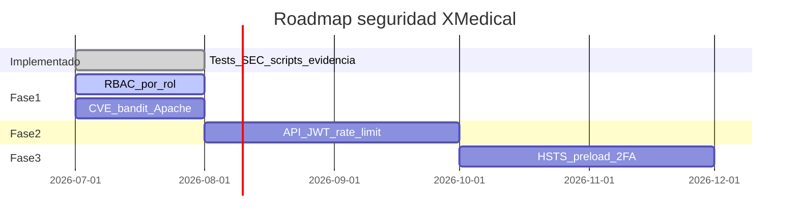

# Roadmap de seguridad — XMedical

Planificación de controles de seguridad: **implementado**, **aceptado** y **pendiente**.

Última actualización: **2026-07-06**

---

## 1. Resumen ejecutivo

| Área | Estado | Evidencia |
|------|--------|-----------|
| Tests automatizados SEC-* | Implementado | [`apps/core/tests_security.py`](../apps/core/tests_security.py) |
| SAST (bandit, pip-audit) | Implementado (con hallazgos abiertos) | [`scripts/verify_security_static.sh`](../scripts/verify_security_static.sh) |
| Headers HTTP prod | Implementado | [`scripts/verify_security_headers.sh`](../scripts/verify_security_headers.sh) |
| OWASP ZAP | Script listo, ejecución mensual | [`scripts/verify_security_zap.sh`](../scripts/verify_security_zap.sh) |
| Login en rutas expuestas | Corregido 2026-07-06 | `cancelar_cita`, `cie10_search`, `historia_clinica` |
| RBAC por rol | Implementado | `apps/core/permissions.py` + tests SEC-13..15 |
| CVE dependencias | Implementado | Django 4.2.30, Pillow 12.2.0, etc. |

---

## 2. Implementado (2026-07)

### 2.1 Correcciones de código

| ID | Cambio | Archivo |
|----|--------|---------|
| SEC-09/10 | `@login_required` en cancelar cita | [`apps/citas/views.py`](../apps/citas/views.py) |
| SEC-10 | `@login_required` en búsqueda CIE-10 e historia | [`apps/consulta/views.py`](../apps/consulta/views.py) |

### 2.2 Pruebas automatizadas

| ID | Caso | Archivo | Estado test |
|----|------|---------|-------------|
| SEC-01 | SQLi búsqueda pacientes | `tests_security.py` | PASS |
| SEC-02 | XSS almacenado | `tests_security.py` | PASS |
| SEC-03 | CSRF sin token | `tests_security.py` | PASS |
| SEC-04 | Auth bypass rutas protegidas | `tests_security.py` | PASS |
| SEC-05 | Aislamiento tenant (2 instituciones) | `tests_security.py` + [`fixtures/security_two_tenants.json`](../fixtures/security_two_tenants.json) | PASS |
| SEC-06 | Rate limiting | `tests_security.py` | SKIP (no implementado) |
| SEC-07 | Médico no puede backup | `tests_security.py` | PASS |
| SEC-09 | IDOR cancelar cita otro tenant | `tests_security.py` | PASS |
| SEC-10 | CIE-10 e historia requieren login | `tests_security.py` | PASS |
| SEC-11 | Cookies Secure + HttpOnly | `tests_security.py` | PASS |
| SEC-12 | X-Frame-Options | `tests_security.py` | PASS |
| SEC-13 | Enfermera bloqueada de consulta | `tests_security.py` | PASS |
| SEC-14 | Recepcionista bloqueada de preclinica | `tests_security.py` | PASS |
| SEC-15 | Medico no crea pacientes / enfermera sin HCE | `tests_security.py` | PASS |
| SEC-S01..03 | bandit, pip-audit, .env fuera de git | `verify_security_static.sh` | Automatizado |
| SEC-08a..g | Headers en producción | `verify_security_headers.sh` | Automatizado |
| SEC-Z01 | ZAP baseline | `verify_security_zap.sh` | Mensual |

### 2.3 Evidencia

Cada ejecución de [`scripts/run_all_verifications.sh`](../scripts/run_all_verifications.sh) guarda:

- `08-seguridad-estatica.txt`
- `09-seguridad-headers.txt`
- `11-django-security-tests.txt`
- `10-seguridad-zap.html` (ZAP aparte, mensual)

Ver [`informes/evidencia/README.md`](informes/evidencia/README.md).

### 2.4 Endurecimiento Fase 1 (2026-07)

| ID | Cambio | Archivo |
|----|--------|---------|
| SEC-P01 | RBAC centralizado con mixins y decoradores | [`apps/core/permissions.py`](../apps/core/permissions.py) |
| SEC-P02 | Dependencias sin CVE High/Critical | [`requirements.txt`](../requirements.txt) |
| SEC-P04 | Apache `ServerTokens Prod` | [`deploy/apache/security-hardening.conf`](../deploy/apache/security-hardening.conf) |
| SEC-P05 | Historia clinica y consulta restringidas por rol | `consulta/views.py`, `pacientes/views.py` |

---

## 3. Warnings aceptados (sin acción inmediata)

| ID | Descripción | Motivo |
|----|-------------|--------|
| W008 | `SECURE_SSL_REDIRECT=False` | Apache redirige HTTP→HTTPS en producción |
| W021 | `SECURE_HSTS_PRELOAD=False` | Preload opcional; requiere validación estricta en hstspreload.org |
| SEC-06 | Rate limit no implementado | Pendiente con API REST ([doc 13](13%20App%20movil%20y%20API%20REST.md)) |
| SEC-08e | Cookie en POST login fallido | WARN en script; login correcto sí emite cookie segura |
| SEC-08g | Header `Server` visible | WARN; endurecer Apache en Fase 1 |

---

## 4. Planificado — Fase 1 (corto plazo, 1–2 semanas)

| ID | Tarea | Entregable | Criterio de cierre |
|----|-------|------------|-------------------|
| SEC-P01 | **RBAC por rol** — mixin/decorador (`MedicoRequired`, `RecepcionRequired`, etc.) | `apps/core/permissions.py` + tests SEC-13..15 | Cada rol solo accede a rutas de su matriz ([doc 7](7%20Documento%20de%20Seguridad.md) §3.3) |
| SEC-P02 | **Remediar CVE pip-audit** | `requirements.txt` actualizado + evidencia SEC-S02 PASS | 0 vulnerabilidades High/Critical |
| SEC-P03 | **Remediar bandit High** | Código corregido + SEC-S01 PASS | 0 issues High en `apps/` |
| SEC-P04 | **Apache hardening** — `ServerTokens Prod`, `ServerSignature Off` | `/etc/apache2/conf-available/security.conf` | SEC-08g PASS |
| SEC-P05 | **Auditoría acceso** — revisar todas las FBV sin `LoginRequiredMixin` | Lista en este doc + tests | 0 rutas clínicas anónimas |
| SEC-P06 | **Documentar matriz rol→ruta** | Tabla en doc 7 §3.4 actualizada | Alineada con tests |

**Historia vinculada:** HU-SEG-002 (Control de acceso por roles) — [`doc 12`](12%20Sprint%20backlog.md).

---

## 5. Planificado — Fase 2 (API REST / móvil)

Vinculado a [`docs/13 App movil y API REST.md`](13%20App%20movil%20y%20API%20REST.md).

| ID | Tarea | Entregable | Criterio |
|----|-------|------------|----------|
| SEC-P10 | Rate limiting (100 req/min) | DRF throttling + test SEC-06 activo | 429 tras umbral |
| SEC-P11 | JWT + refresh tokens | `apps/api/` + tests API-01..06 | Sin token → 401 |
| SEC-P12 | RBAC en API | `permissions.py` DRF | Claims `institucion_id`, `rol` |
| SEC-P13 | ZAP con contexto autenticado | Hook ZAP + SEC-Z02/Z03 | Spider rutas protegidas |

---

## 6. Planificado — Fase 3 (endurecimiento)

| ID | Tarea | Frecuencia | Notas |
|----|-------|------------|-------|
| SEC-P20 | HSTS preload | Una vez | Tras validar redirects www/apex |
| SEC-P21 | 2FA administradores | Fase producto | django-otp ([doc 7](7%20Documento%20de%20Seguridad.md) §3.1) |
| SEC-P22 | Escaneo Trivy (Docker) | Semanal | PostgreSQL, Redis, imágenes |
| SEC-P23 | Rotación SECRET_KEY | Semestral | Procedimiento en CHECKLIST-SEGURIDAD |
| SEC-P24 | Deshabilitar usuarios demo en prod | Pre go-live | `USUARIOS_PRUEBA.md` solo staging |
| SEC-P25 | Auditoría semestral OWASP | Semestral | Informe externo o ZAP full |

---

## 7. Cronograma sugerido

| Cuándo | Qué ejecutar |
|--------|--------------|
| Cada deploy / diario | `./scripts/run_all_verifications.sh` |
| Semanal | Revisar FAIL en `08-seguridad-estatica.txt` |
| Mensual | `./scripts/verify_security_zap.sh` |
| Pre-release | [`CHECKLIST-SEGURIDAD.md`](CHECKLIST-SEGURIDAD.md) |

---

## 8. Matriz rol → rutas (estado actual vs objetivo)

| Ruta | Hoy | Objetivo Fase 1 |
|------|-----|-----------------|
| `/pacientes/*` | Cualquier usuario logueado | recepcion, admin, medico, superadmin |
| `/citas/*` | Cualquier usuario logueado | recepcion, admin, superadmin |
| `/preclinica/*` | Cualquier usuario logueado | enfermera, medico, superadmin |
| `/consulta/*` | Cualquier usuario logueado | medico, superadmin |
| `/superadmin/*` | `is_superuser` | Sin cambio |
| `/auth/registro/` | admin (LoginRequired) | admin institución, superadmin |

---

## 9. Referencias

| Documento | Contenido |
|-----------|-----------|
| [7 Documento de Seguridad](7%20Documento%20de%20Seguridad.md) | Políticas y controles |
| [10 Plan de Pruebas](10%20Plan%20de%20Pruebas.md) | IDs SEC-* en mapa de casos |
| [CHECKLIST-SEGURIDAD](CHECKLIST-SEGURIDAD.md) | Revisión manual pre-release |
| [13 App móvil y API REST](13%20App%20movil%20y%20API%20REST.md) | Fase 2 JWT y rate limit |
