# DOCUMENTO 5: DIAGRAMAS DE FLUJO
## XMedical - Sistema de Gestión Clínica Multi-tenant para Primer y Segundo Nivel

| Versión | Fecha | Autor | Estado |
|---------|-------|-------|--------|
| 1.0 | 2026 | Agente de Documentación Técnica | **Aprobado** |

---

## 1. VISIÓN GENERAL

Este documento contiene los **diagramas de flujo** para los principales procesos de XMedical, organizados en:

- **User Flows**: Flujo que sigue el usuario en la interfaz (paso a paso)
- **System Flows**: Flujo interno del sistema (lógica, decisiones, integraciones)

**Formato:** Mermaid (compatible con GitHub, Markdown, y documentación técnica)

---

## 2. USER FLOWS (FLUJOS DE USUARIO)

### 2.1 Flujo de Autenticación Multi-tenant

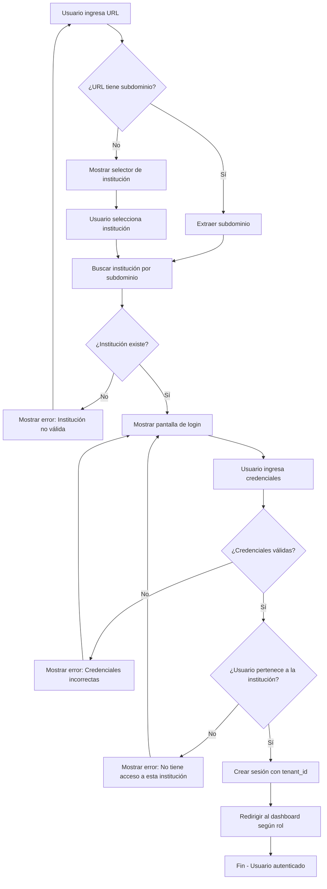

---

### 2.2 Flujo de Registro de Paciente (Recepcionista)

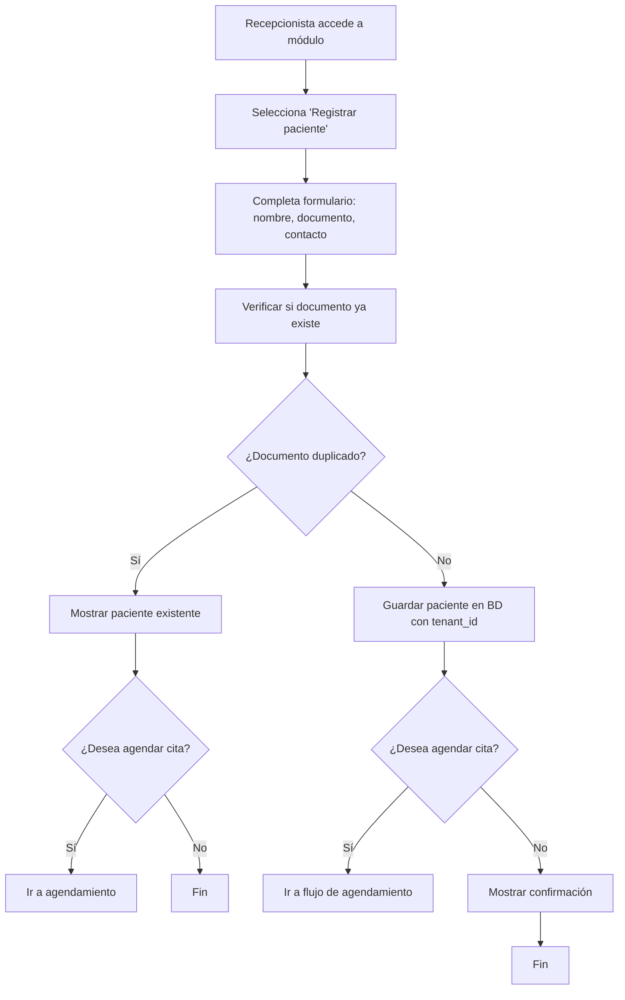

---

### 2.3 Flujo de Agendamiento de Cita (Específico)

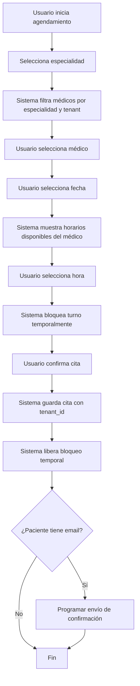

---

### 2.4 Flujo de Consulta Médica (7 pasos guiados)

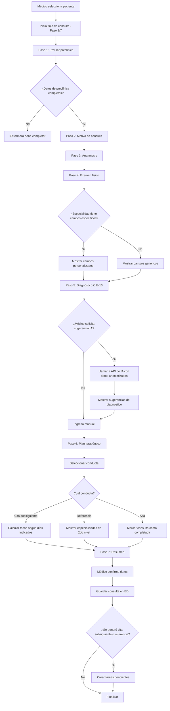

---

### 2.5 Flujo de Referencia a Especialista (1er → 2do nivel)

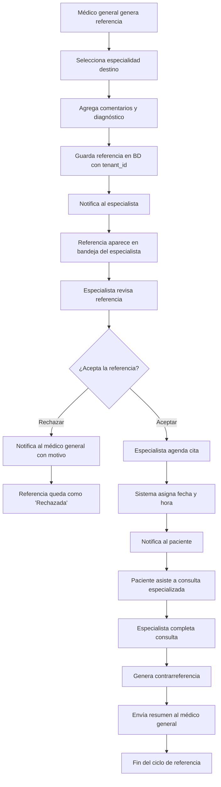

---

### 2.6 Flujo del Paciente (Autoagendamiento Web)

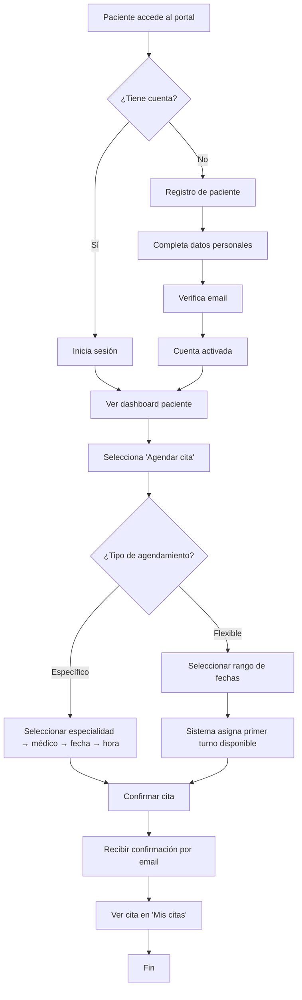

---

## 3. SYSTEM FLOWS (FLUJOS DE SISTEMA)

### 3.1 Flujo de Identificación Multi-tenant (Middleware)

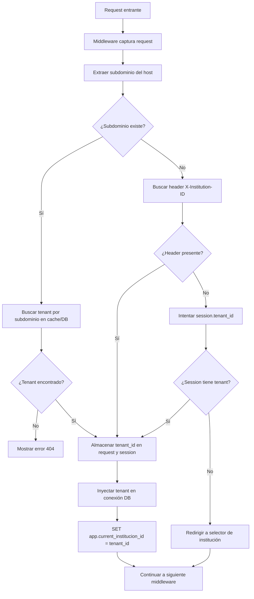

---

### 3.2 Flujo de Aislamiento de Datos (RLS PostgreSQL)

```mermaid
flowchart TD
    A[Aplicación ejecuta consulta SQL] --> B[Consulta: SELECT * FROM paciente]
    B --> C[PostgreSQL recibe consulta]
    C --> D[Verifica si tabla tiene RLS habilitado]
    D --> E{¿RLS activo?}
    
    E -->|No| F[Ejecutar consulta sin filtro]
    
    E -->|Sí| G[Verificar política para la tabla]
    G --> H[Política: WHERE institucion_id = current_setting(...)]
    H --> I[Obtener current_setting('app.current_institucion_id')]
    I --> J{¿Valor existe?}
    
    J -->|No| K[Rechazar consulta - sin contexto tenant]
    J -->|Sí| L[Filtrar resultados por tenant_id]
    
    L --> M[Ejecutar consulta con filtro]
    M --> N[Retornar solo resultados del tenant actual]
    
    F --> O[Retornar todos los resultados]
    K --> P[Retornar error]
```

---

### 3.3 Flujo de Agendamiento (Lógica de Disponibilidad)

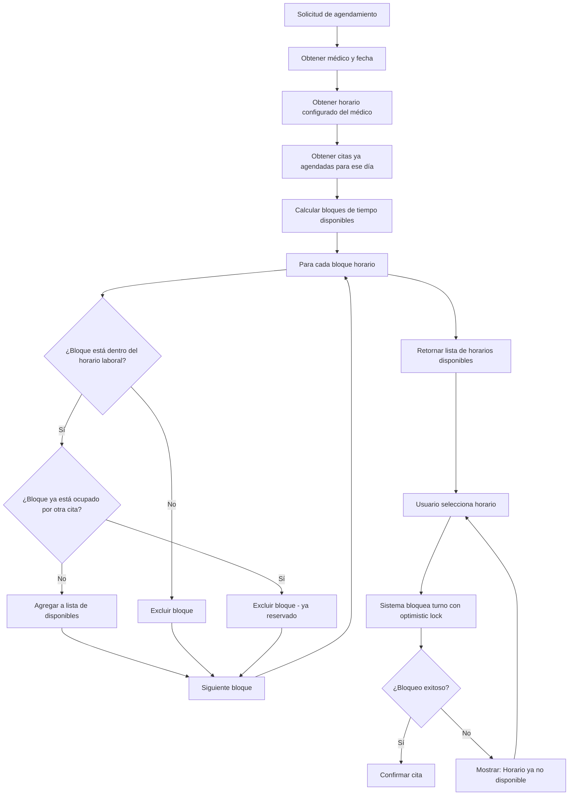

---

### 3.4 Flujo de Recordatorios (Tarea Programada Celery)

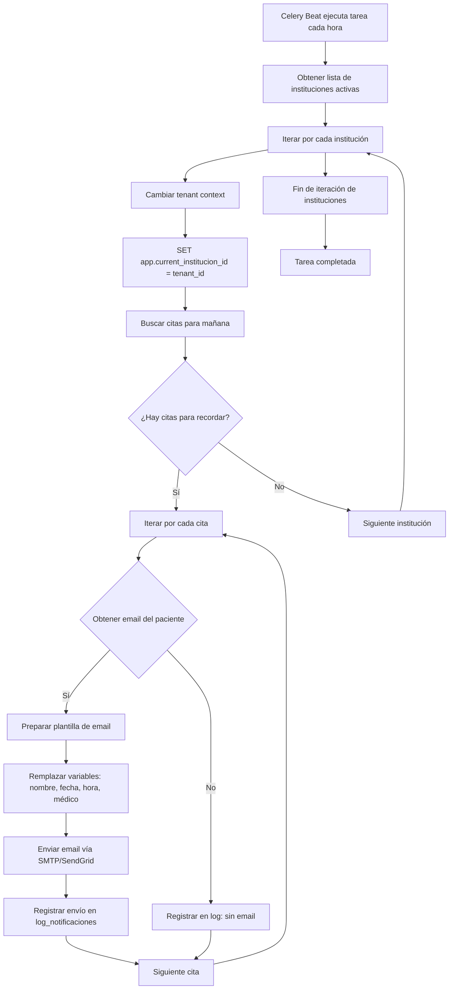

---

### 3.5 Flujo de Backups Automáticos

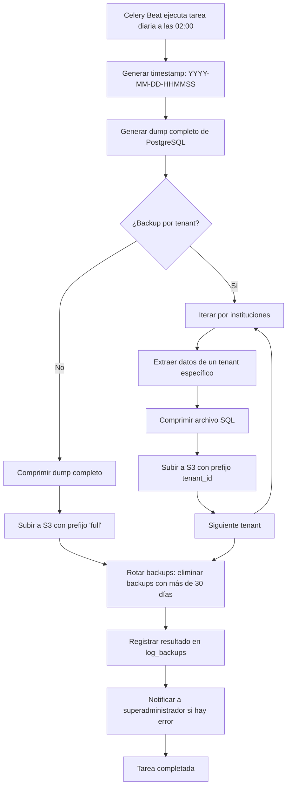

---

### 3.6 Flujo de Generación de QR

```mermaid
flowchart TD
    A[Médico genera orden o receta] --> B[Tipo de documento]
    B --> C{¿Qué tipo?}
    
    C -->|Examen| D[Generar payload: {\"tipo\":\"examen\",\"id\":123,\"tenant\":1}]
    C -->|Receta| E[Generar payload: {\"tipo\":\"receta\",\"id\":456,\"tenant\":1,\"caducidad\":\"2026-07-01\"}]
    C -->|Check-in| F[Generar payload: {\"tipo\":\"checkin\",\"cita_id\":789,\"tenant\":1}]
    
    D --> G[Encriptar payload (AES)]
    E --> G
    F --> G
    
    G --> H[Generar código QR con biblioteca segno]
    H --> I[Guardar imagen QR en storage S3/NFS]
    I --> J[Guardar referencia en BD: tabla documento_qr]
    J --> K[Devolver URL del QR]
    K --> L[Mostrar QR en pantalla]
    L --> M[Opción: enviar QR por email al paciente]
    M --> N[Fin]
```

---

## 4. DIAGRAMAS ADICIONALES

### 4.1 Flujo de Onboarding de Nuevo Tenant (Superadministrador)

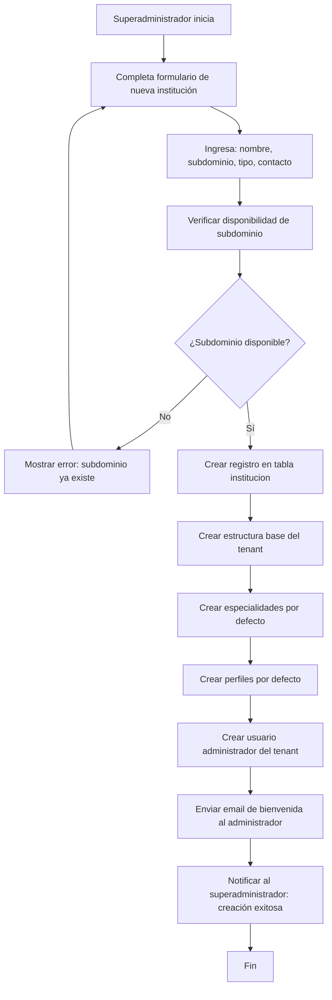

---

### 4.2 Flujo de Recuperación de Contraseña

```mermaid
flowchart TD
    A[Usuario olvida contraseña] --> B[Hace clic en 'Olvidé mi contraseña']
    B --> C[Ingresa email asociado a cuenta]
    C --> D[Sistema verifica email existe y pertenece al tenant]
    D --> E{¿Email válido?}
    
    E -->|No| F[Mostrar mensaje: email no registrado]
    F --> C
    
    E -->|Sí| G[Generar token único con expiración (1 hora)]
    G --> H[Guardar token en BD]
    H --> I[Enviar email con enlace: /reset-password?token=XXX]
    I --> J[Usuario hace clic en enlace]
    J --> K[Validar token expiración]
    K --> L{¿Token válido?}
    
    L -->|No| M[Mostrar error: enlace expirado]
    M --> B
    
    L -->|Sí| N[Mostrar formulario nueva contraseña]
    N --> O[Usuario ingresa nueva contraseña]
    O --> P[Validar seguridad de contraseña]
    P --> Q[Actualizar password en BD]
    Q --> R[Marcar token como usado]
    R --> S[Redirigir a login]
    S --> T[Fin]
```

---

## 5. LEYENDA DE SÍMBOLOS

| Símbolo | Significado |
|---------|-------------|
| `A[Texto]` | Inicio o Fin del proceso |
| `B{Decisión}` | Condicional (Sí/No, Verdadero/Falso) |
| `C[Proceso]` | Acción o operación realizada por el sistema |
| `D[Tarea usuario]` | Acción realizada por el usuario |
| `E(Subproceso)` | Llamada a otro diagrama o subproceso |
| `F[/Almacenamiento/]` | Persistencia de datos (BD, archivo) |
| `G((Conector))` | Conexión entre diagramas |

---

## 6. APROBACIÓN

| Rol | Nombre | Firma | Fecha |
|-----|--------|-------|-------|
| Product Owner | [Usuario] | ✅ Aprobado | 2026 |
| Agente Documentación | DeepSeek | Generado | 2026 |

---

**Fin del Documento 5: Diagramas de Flujo**

---

## RESUMEN DEL DOCUMENTO

| Aspecto | Valor |
|---------|-------|
| **Total de diagramas** | 11 |
| **User Flows** | 6 (autenticación, registro paciente, agendamiento, consulta, referencia, autoagendamiento) |
| **System Flows** | 6 (multi-tenant, RLS, disponibilidad, recordatorios, backups, QR) |
| **Flujos adicionales** | 2 (onboarding tenant, recuperación contraseña) |
| **Formato** | Mermaid (compatible con GitHub/Markdown) |

---