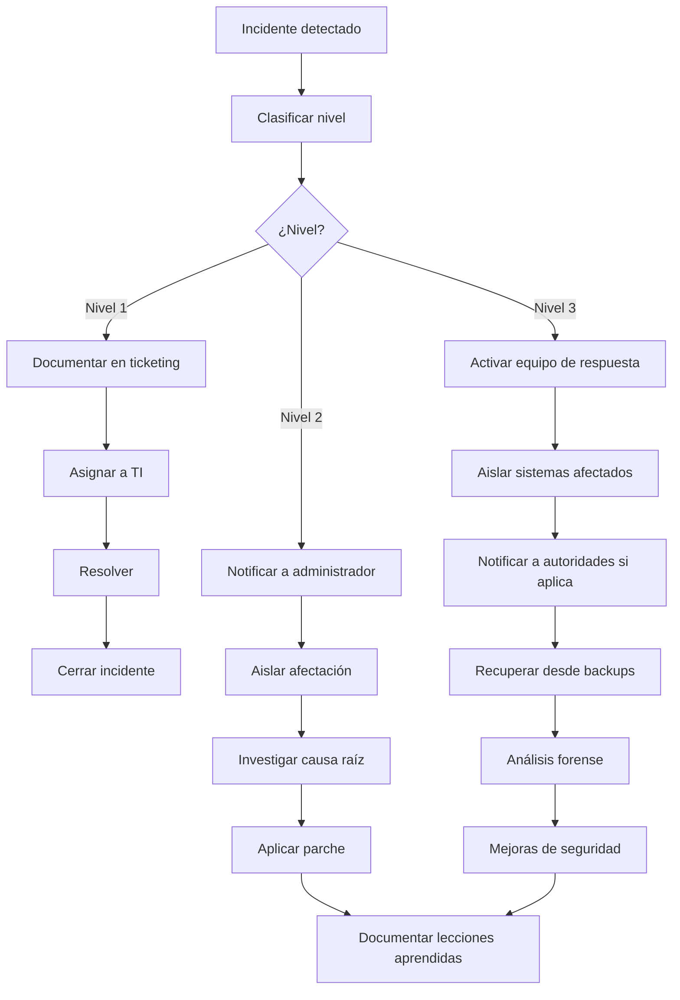

# DOCUMENTO 7: SEGURIDAD
## XMedical - Sistema de Gestión Clínica Multi-tenant para Primer y Segundo Nivel

| Versión | Fecha | Autor | Estado |
|---------|-------|-------|--------|
| 1.0 | 2026 | Agente de Documentación Técnica | **Aprobado** |

---

## 1. VISIÓN GENERAL

Este documento define las **políticas y controles de seguridad** de XMedical, organizados en:

- **Clasificación de información**
- **Control de acceso** (autenticación, autorización, roles)
- **Cifrado** (en tránsito, en reposo)
- **Seguridad de infraestructura**
- **Protección de APIs**
- **Logging y monitoreo**
- **Backups y recuperación**
- **Gestión de vulnerabilidades**
- **Respuesta a incidentes**

---

## 2. CLASIFICACIÓN DE LA INFORMACIÓN

| Nivel | Descripción | Ejemplos | Medidas requeridas |
|-------|-------------|----------|-------------------|
| **PÚBLICO** | Información sin restricciones | Nombres de especialidades, horarios base | Sin protección especial |
| **INTERNO** | Uso interno de la institución | Lista de médicos, horarios por profesional | Control de acceso básico |
| **CONFIDENCIAL** | Datos personales de pacientes | Datos de contacto, documentos | Cifrado en reposo, auditoría |
| **RESTRINGIDO** | Datos clínicos sensibles | Diagnósticos, historia clínica | Cifrado, RLS, auditoría, trazabilidad |
| **CRÍTICO** | Datos de autenticación | Credenciales, tokens JWT | Hash (bcrypt/argon2), rotación periódica |

---

## 3. CONTROL DE ACCESO

### 3.1 Autenticación

| Método | Implementación | Uso |
|--------|----------------|-----|
| **Session-based** | Django sessions + cookies | Web app (Médicos, Enfermeras, Admin) |
| **JWT (JSON Web Token)** | Django REST Framework + SimpleJWT | API, integraciones |
| **2FA (opcional)** | Django-otp | Usuarios administradores (Fase 2) |
| **Social Auth (futuro)** | Google/Microsoft OAuth | Portal de pacientes (Fase 3) |

### 3.2 Política de contraseñas

| Parámetro | Valor |
|-----------|-------|
| Longitud mínima | 8 caracteres |
| Complejidad | Al menos 1 mayúscula, 1 número, 1 símbolo |
| Expiración | 90 días (administradores), 180 días (médicos) |
| Historial | No repetir últimas 5 contraseñas |
| Intentos fallidos | Bloqueo temporal después de 5 intentos (15 minutos) |
| Recuperación | Enlace por email con token (expira 1 hora) |

### 3.3 Roles y permisos (RBAC)

| Rol | Alcance | Permisos clave |
|-----|---------|----------------|
| **Superadministrador** | Global | Crear/editar instituciones, gestionar tenants, ver logs globales |
| **Administrador institución** | Su tenant | Configurar especialidades, profesionales, horarios, usuarios |
| **Médico** | Su tenant | Ver agenda, consultas, historia clínica, referencias |
| **Enfermera** | Su tenant | Preclínica, signos vitales, triaje |
| **Recepcionista** | Su tenant | Registrar pacientes, agendar citas, cancelar |
| **Paciente** | Su tenant (solo sus datos) | Autoagendamiento, ver resultados, HCE portátil |

### 3.4 Matriz de permisos (por tenant)

| Recurso | Superadmin | Admin Inst | Médico | Enfermera | Recepción | Paciente |
|---------|------------|------------|--------|-----------|-----------|----------|
| Gestionar instituciones | ✅ | ❌ | ❌ | ❌ | ❌ | ❌ |
| Configurar especialidades | ✅ | ✅ | ❌ | ❌ | ❌ | ❌ |
| Gestionar profesionales | ✅ | ✅ | ❌ | ❌ | ❌ | ❌ |
| Ver pacientes | ✅ | ✅ | ✅ | ✅ | ✅ | ❌* |
| Ver historia clínica | ✅ | ✅ | ✅ | ❌ | ❌ | ✅** |
| Crear/editar pacientes | ✅ | ✅ | ❌ | ❌ | ✅ | ❌*** |
| Agendar citas | ✅ | ✅ | ❌ | ❌ | ✅ | ✅ |
| Cancelar citas | ✅ | ✅ | ✅ | ❌ | ✅ | ✅ |
| Realizar preclínica | ✅ | ✅ | ❌ | ✅ | ❌ | ❌ |
| Realizar consulta | ✅ | ✅ | ✅ | ❌ | ❌ | ❌ |
| Ver auditoría | ✅ | ✅ | ❌ | ❌ | ❌ | ❌ |
| Exportar datos | ✅ | ✅ | ❌ | ❌ | ❌ | ❌ |

*Solo sus propios datos
**Solo su propia HCE
***Auto-registro

---

## 4. CIFRADO

### 4.1 Cifrado en tránsito

| Capa | Protocolo | Certificado | Implementación |
|------|-----------|-------------|----------------|
| **Web** | TLS 1.3 | Let's Encrypt / Comercial | Nginx SSL termination |
| **API** | TLS 1.3 | Mismo certificado | Django + Nginx |
| **Base de datos** | TLS 1.3 | Certificado interno | PostgreSQL SSL |
| **Redis** | TLS 1.3 | Certificado interno | Redis TLS |

### 4.2 Cifrado en reposo

| Dato | Método | Implementación |
|------|--------|----------------|
| Contraseñas | Hash + Salt | Django: PBKDF2 (por defecto), bcrypt (recomendado) |
| Tokens JWT | Firma HMAC-SHA256 | `SIGNING_KEY` en variables de entorno |
| Datos sensibles (opcional) | AES-256 | Django `django-cryptography` (Fase 3) |
| Backups | GPG / AES-256 | Script de backup con cifrado |
| Logs | Sin datos sensibles | Filtro automático de PII |

### 4.3 Columnas a cifrar (Fase 3 - opcional)

```python
# models.py - Ejemplo de campo cifrado
from cryptography.fernet import Fernet

class Paciente(models.Model):
    # Datos sensibles que pueden requerir cifrado
    documento = EncryptedCharField(max_length=20)  # Opcional
    telefono = EncryptedCharField(max_length=20)   # Opcional
    email = models.EmailField()  # Sin cifrar (necesario para notificaciones)
```

---

## 5. SEGURIDAD DE INFRAESTRUCTURA

### 5.1 Configuración de red

```
┌─────────────────────────────────────────────────────────────────┐
│                         INTERNET                                 │
└───────────────────────────────┬─────────────────────────────────┘
                                │
                                ▼
┌─────────────────────────────────────────────────────────────────┐
│                    FIREWALL (iptables / Cloud)                   │
│                    - Solo puertos 80, 443 abiertos               │
│                    - Rate limiting por IP                        │
│                    - DDoS protection                             │
└───────────────────────────────┬─────────────────────────────────┘
                                │
                                ▼
┌─────────────────────────────────────────────────────────────────┐
│                    REVERSE PROXY (Nginx)                         │
│                    - SSL Termination                             │
│                    - Rate limiting                               │
│                    - WAF (ModSecurity)                           │
└───────────────────────────────┬─────────────────────────────────┘
                                │
                                ▼
┌─────────────────────────────────────────────────────────────────┐
│                    APPLICATION (Django)                          │
│                    - Gunicorn interno                            │
│                    - Solo localhost                              │
└─────────────────────────────────────────────────────────────────┘
```

### 5.2 Puertos y servicios

| Servicio | Puerto | Acceso | Justificación |
|----------|--------|--------|---------------|
| HTTP | 80 | Solo redirección a HTTPS | Redirección |
| HTTPS | 443 | Público | Web app y API |
| SSH | 22 | Restringido (VPN/lista IPs) | Administración |
| PostgreSQL | 5432 | Localhost (socket Unix) | Base de datos |
| Redis | 6379 | Localhost | Cache y Celery |
| Celery | - | - | Worker interno |

### 5.3 Variables de entorno (secretos)

```bash
# .env (nunca en repositorio)
SECRET_KEY=clave_super_secreta_django
DB_PASSWORD=contraseña_postgres
REDIS_PASSWORD=contraseña_redis
JWT_SIGNING_KEY=clave_jwt
SENDGRID_API_KEY=api_key
S3_ACCESS_KEY=access_key
S3_SECRET_KEY=secret_key
ENCRYPTION_KEY=clave_aes_256_base64
```

---

## 6. PROTECCIÓN DE APIS

### 6.1 Autenticación API

```http
POST /api/token/
Content-Type: application/json

{
    "username": "doctor@clinica.cl",
    "password": "********"
}

Response:
{
    "access": "eyJhbGciOiJIUzI1NiIs...",
    "refresh": "eyJhbGciOiJIUzI1NiIs..."
}
```

### 6.2 Headers requeridos

```http
GET /api/pacientes/
Authorization: Bearer <access_token>
X-Institution-ID: 1  # Opcional (si no se usa subdominio)
Content-Type: application/json
```

### 6.3 Rate limiting

| Endpoint | Límite | Período | Usuario |
|----------|--------|---------|---------|
| `/api/auth/login` | 5 | 15 minutos | Por IP |
| `/api/pacientes/` | 100 | 1 minuto | Por usuario |
| `/api/citas/disponibles` | 200 | 1 minuto | Por usuario |
| `/api/consultas/` | 50 | 1 minuto | Por usuario |
| `/api/reportes/*` | 10 | 1 minuto | Por usuario |

### 6.4 Validación de entrada (Input validation)

| Tipo de dato | Validación | Implementación |
|--------------|------------|----------------|
| Documento | Formato, dígito verificador | Django validators + regex |
| Email | Formato, MX record (opcional) | EmailValidator |
| Fechas | Rango válido, no futuro | Date validation |
| Códigos CIE-10 | Existe en catálogo | Foreign key / lookup |
| HTML/Text | Escapado automático | Django templates autoescape |

### 6.5 Protección contra ataques web

| Ataque | Mitigación | Implementación |
|--------|------------|----------------|
| **SQL Injection** | ORM + parámetros | Django ORM, no SQL crudo |
| **XSS (Cross-site)** | Escapado automático | Django templates autoescape |
| **CSRF** | Tokens CSRF | Django CSRF middleware |
| **Clickjacking** | X-Frame-Options | Django `XFrameOptionsMiddleware` |
| **MIME sniffing** | X-Content-Type-Options | Django SecurityMiddleware |
| **XSS (headers)** | Content-Security-Policy | Nginx + Django |
| **Rate limiting** | Límite por IP/usuario | Django Ratelimit |
| **Brute force** | Bloqueo temporal | Axes / Ratelimit |

---

## 7. LOGGING Y MONITOREO

### 7.1 Tipos de logs

| Log | Contenido | Retención | Acceso |
|-----|-----------|-----------|--------|
| `app.log` | Eventos de aplicación | 30 días | Administradores |
| `access.log` | Requests HTTP | 90 días | Administradores, superadmin |
| `error.log` | Errores (4xx, 5xx) | 90 días | Administradores |
| `auth.log` | Intentos de login | 365 días | Superadministrador |
| `audit.log` | Cambios en datos clínicos | 7 años (legal) | Auditoría, superadmin |
| `db.log` | Consultas lentas (>200ms) | 30 días | DBA |

### 7.2 Formato de log (JSON estructurado)

```json
{
    "timestamp": "2026-06-04T10:30:00Z",
    "level": "INFO",
    "tenant_id": 1,
    "user_id": 42,
    "user_role": "medico",
    "ip": "190.10.10.100",
    "method": "POST",
    "path": "/api/consultas/",
    "status_code": 201,
    "duration_ms": 45,
    "event": "consulta_creada",
    "consulta_id": 123
}
```

### 7.3 Monitoreo y alertas

| Métrica | Umbral | Acción |
|---------|--------|--------|
| CPU > 80% | 5 minutos | Alerta a TI |
| Memoria > 85% | 5 minutos | Alerta a TI |
| Error rate > 1% | 1 minuto | Alerta crítica |
| Requests lentos > 2s | 10 requests | Revisar SQL |
| Login fallidos > 5/IP | 15 minutos | Bloquear IP temporal |
| Logout anormal | - | Revisar auditoría |

### 7.4 Herramientas sugeridas

| Herramienta | Propósito |
|-------------|-----------|
| **Prometheus** | Métricas del sistema |
| **Grafana** | Dashboards de monitoreo |
| **Loki** | Agregación de logs |
| **Sentry** | Errores de aplicación |
| **New Relic** (opcional) | APM y trazabilidad |

---

## 8. BACKUPS Y RECUPERACIÓN

### 8.1 Estrategia de backups

| Tipo | Frecuencia | Retención | Destino | Cifrado |
|------|------------|-----------|---------|---------|
| **Full (completo)** | Diario (02:00) | 30 días | S3 / NFS | AES-256 |
| **Incremental** | Cada 6 horas | 7 días | S3 / NFS | AES-256 |
| **WAL (log)** | Cada hora | 7 días | S3 / NFS | AES-256 |
| **Por tenant** | Diario | 30 días | S3 / NFS | AES-256 |

### 8.2 Restauración

| Escenario | Tiempo objetivo (RTO) | Punto objetivo (RPO) |
|-----------|----------------------|---------------------|
| Falla de servidor | < 4 horas | < 1 hora |
| Error de datos (soft delete) | < 1 hora | < 5 minutos |
| Desastre (zona completa) | < 24 horas | < 24 horas |
| Corrupción de datos | < 8 horas | < 12 horas |

### 8.3 Procedimiento de backup

```bash
#!/bin/bash
# backup.sh - Backup diario con rotación

DATE=$(date +%Y%m%d_%H%M%S)
TENANT_ID=$1

# Backup completo
pg_dump -U xmedical_user -d xmedical_db \
    | gzip \
    | gpg --encrypt --recipient backup@xmedical.com \
    > /backups/xmedical_full_${DATE}.sql.gz.gpg

# Backup por tenant
pg_dump -U xmedical_user -d xmedical_db \
    --data-only \
    --table=* \
    --where="institucion_id=${TENANT_ID}" \
    | gzip \
    | gpg --encrypt \
    > /backups/xmedical_tenant_${TENANT_ID}_${DATE}.sql.gz.gpg

# Upload a S3
aws s3 cp /backups/ s3://xmedical-backups/ --recursive

# Rotación: eliminar backups > 30 días
find /backups -type f -mtime +30 -delete
```

---

## 9. GESTIÓN DE VULNERABILIDADES

### 9.1 Dependencias y actualizaciones

| Componente | Frecuencia de actualización | Método |
|------------|----------------------------|--------|
| Django | Según releases | `pip install -U django` |
| PostgreSQL | Parches de seguridad | `apt upgrade postgresql` |
| Nginx | Parches de seguridad | `apt upgrade nginx` |
| Python packages | Semanal | `pip-audit`, `safety check` |
| Certificados SSL | Automático (60 días) | Certbot |

### 9.2 Escaneo de vulnerabilidades

| Herramienta | Frecuencia | Objetivo |
|-------------|------------|----------|
| `pip-audit` | CI/CD | Vulnerabilidades en paquetes Python |
| `safety` | Semanal | Base de datos de vulnerabilidades |
| `bandit` | CI/CD | Análisis estático de seguridad |
| `OWASP ZAP` | Mensual | Escaneo dinámico de aplicación |
| `trivy` | Semanal | Escaneo de contenedores Docker |

### 9.3 Gestión de dependencias

```bash
# Verificar vulnerabilidades en CI/CD
pip-audit --requirement requirements.txt --format json

# Actualizar dependencias
pip install --upgrade django djangorestframework
pip-audit fix  # Automático (experimental)
```

---

## 10. RESPUESTA A INCIDENTES

### 10.1 Clasificación de incidentes

| Nivel | Descripción | Ejemplos | Respuesta |
|-------|-------------|----------|-----------|
| **Nivel 1** | Incidente menor | Usuario no puede acceder, error no crítico | < 4 horas |
| **Nivel 2** | Incidente moderado | Fuga de datos no sensible, indisponibilidad parcial | < 2 horas |
| **Nivel 3** | Incidente crítico | Fuga de datos clínicos, ransomware, indisponibilidad total | Inmediato |

### 10.2 Procedimiento de respuesta



### 10.3 Contactos de emergencia

| Rol | Responsabilidad | Contacto |
|-----|-----------------|----------|
| Security Officer | Coordinación de respuesta | security@xmedical.com |
| System Administrator | Infraestructura | sysadmin@xmedical.com |
| DBA | Base de datos | dba@xmedical.com |
| Legal | Notificaciones legales | legal@xmedical.com |

---

## 11. CUMPLIMIENTO NORMATIVO

| Normativa | Requisitos | Estado |
|-----------|------------|--------|
| **Ley 19.628 (Chile)** | Protección de datos personales | ✅ Cumple |
| **Ley 20.584 (Chile)** | Derechos y deberes de pacientes | ✅ Cumple |
| **GDPR (Europa, futuro)** | Datos personales | 🔮 Planificado |
| **HIPAA (USA, futuro)** | Datos clínicos | 🔮 Planificado |
| **HL7/FHIR (estándar)** | Interoperabilidad | 🔮 Planificado |

---

## 12. APROBACIÓN

| Rol | Nombre | Firma | Fecha |
|-----|--------|-------|-------|
| Product Owner | [Usuario] | ✅ Aprobado | 2026 |
| Security Officer | [Usuario] | ✅ Aprobado | 2026 |
| Agente Documentación | DeepSeek | Generado | 2026 |

---

**Fin del Documento 7: Seguridad**

---

## RESUMEN DEL DOCUMENTO

| Aspecto | Valor |
|---------|-------|
| **Niveles de información** | 5 |
| **Roles definidos** | 6 |
| **Matriz de permisos** | 6 x 12 |
| **Tipo de cifrado** | TLS 1.3 (tránsito), AES-256 (reposo) |
| **Puertos abiertos** | 2 (80, 443) |
| **Rate limiting** | 5 endpoints definidos |
| **Logs** | 6 tipos con retención |
| **Backups** | 4 estrategias |
| **Herramientas de seguridad** | 8+ |
| **Niveles de incidentes** | 3 |

---
