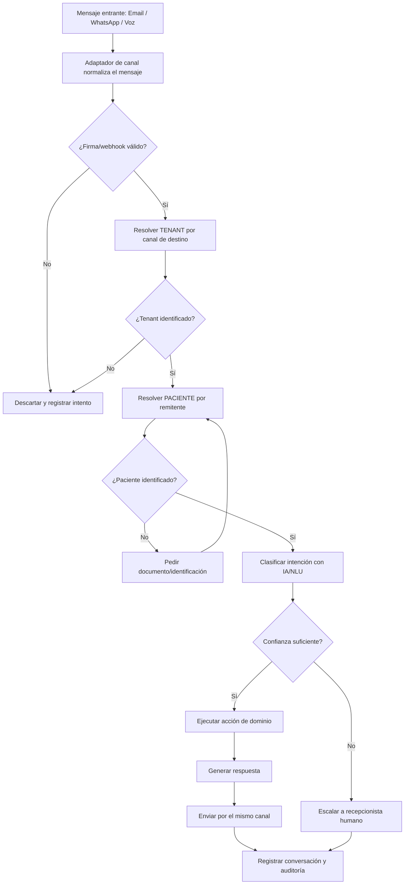
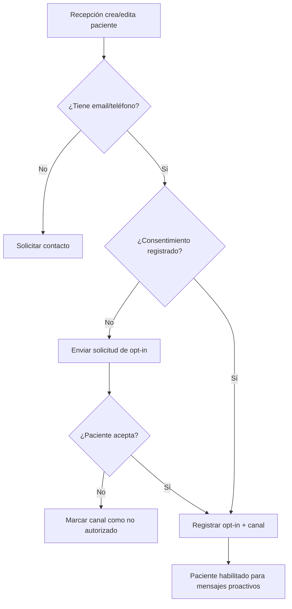
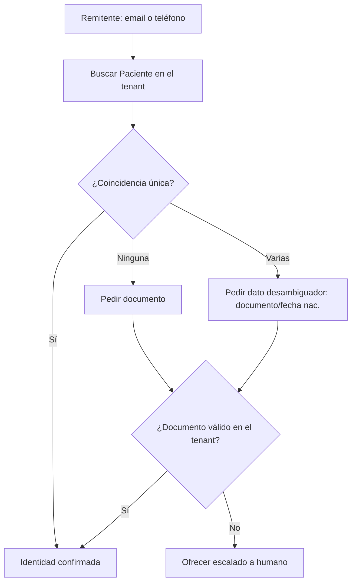
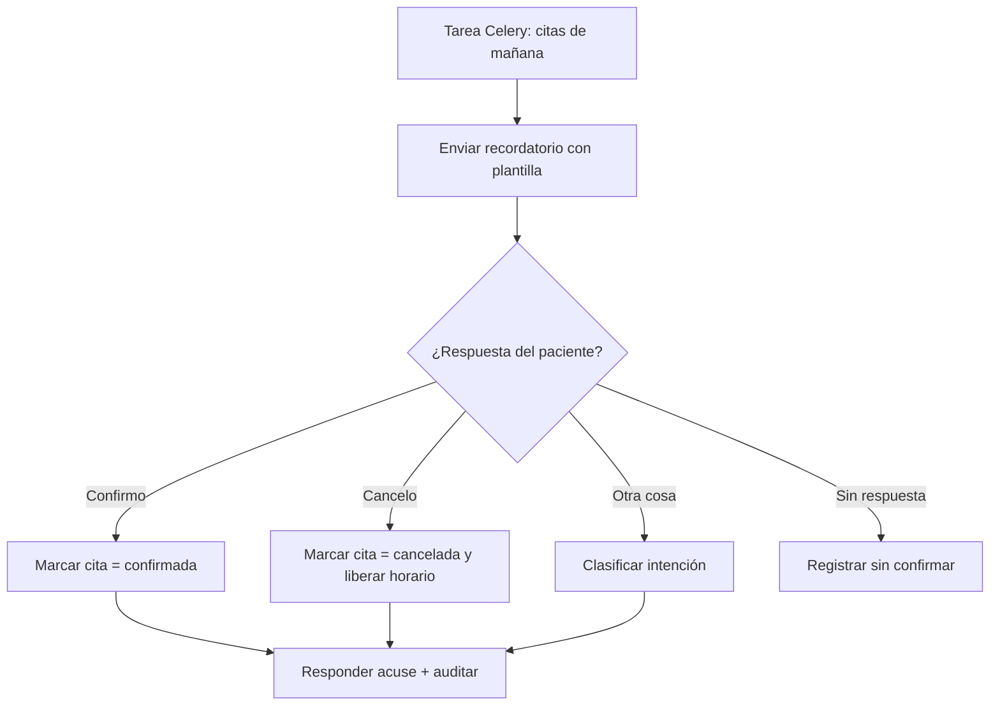
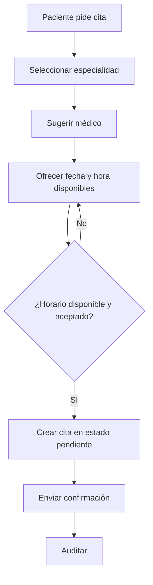
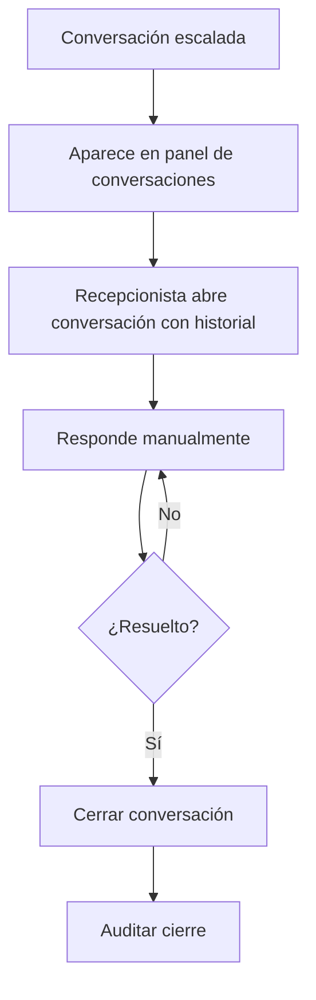
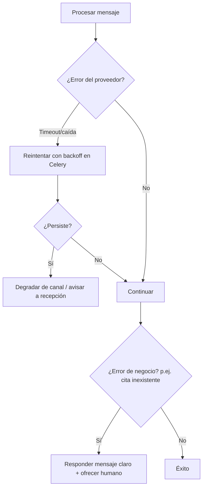

# 2. FLUJO DE LA APLICACIÓN
## Módulo: Recepción Virtual Omnicanal (XMedical)

| Versión | Fecha | Autor | Estado |
|---------|-------|-------|--------|
| 0.1 | 2026-07 | Equipo XMedical | **Borrador** |

> Responde a **¿qué hace el usuario paso a paso?**. Muestra el recorrido de usuarios, canales y decisiones. Se apoya en el [PRD](01%20PRD%20-%20Recepcion%20Virtual.md).

---

## 1. Flujo de alto nivel (mensaje entrante)

---

## 2. Flujo de "registro" (opt-in del canal)

En este módulo el "registro" es el **consentimiento del paciente** para ser contactado por un canal.

---

## 3. Flujo de identificación ("inicio de sesión" del paciente)

Los canales externos no usan sesión web; la identidad se resuelve por el remitente.

---

## 4. Flujo principal por tipo de usuario

### 4.1 Paciente — recordatorio y confirmación (CU-01)

### 4.2 Paciente — agendamiento (CU-05, Fase 2)

### 4.3 Recepcionista humano — handoff

---

## 5. Flujo de creación / edición / eliminación de datos

Las acciones sobre citas reutilizan la lógica de dominio existente (o la API REST planificada):

| Acción | Disparador conversacional | Resultado |
|--------|---------------------------|-----------|
| Confirmar cita | "confirmo", "sí asistiré" | `Cita.estado = confirmada` |
| Cancelar cita | "cancelar", "no puedo ir" | `Cita.estado = cancelada` + liberar cupo |
| Reprogramar (Fase 2) | "cambiar mi cita" | Cancelar + crear nueva |
| Crear cita (Fase 2) | "quiero una cita" | `Cita` nueva `pendiente` |

---

## 6. Validaciones

- Verificar **firma/HMAC** del webhook antes de procesar (email/WhatsApp/voz).
- Confirmar que el **paciente es titular** de la cita antes de modificarla (RN-06).
- Validar que la acción esté permitida en el **horario de atención** configurado (mensajes proactivos).
- Validar formato de contacto (email/teléfono) al registrar opt-in.
- Verificar disponibilidad real del horario antes de agendar (Fase 2).

---

## 7. Decisiones del sistema

- **Resolución de tenant:** por número/línea o alias de correo de destino.
- **Confianza de intención:** umbral configurable; por debajo → escalar.
- **Ventana de conversación (WhatsApp):** dentro de 24 h respuesta libre; fuera, solo plantillas aprobadas.
- **Elección de canal de respuesta:** siempre el mismo por el que llegó el mensaje.

---

## 8. Excepciones y errores

Casos a cubrir: paciente no identificado, cita no encontrada, canal no autorizado, proveedor caído, mensaje no entendido, duplicados (idempotencia por `externo_id`).

---

## 9. Notificaciones

| Evento | Notificación | Canal |
|--------|--------------|-------|
| Cita agendada/confirmada | Acuse al paciente | Mismo canal |
| 24 h antes de la cita | Recordatorio proactivo | Email/WhatsApp |
| Conversación escalada | Aviso al recepcionista | Panel web / correo interno |
| Cita cancelada por paciente | Aviso a la clínica | Panel / correo interno |

---

## 10. Referencias

- [PRD — Recepción Virtual](01%20PRD%20-%20Recepcion%20Virtual.md)
- [Documento 5: Diagramas de Flujo (clínicos)](../5%20Documento%20Diagramas%20de%20Flujo.md)

---

**Fin del Flujo — Recepción Virtual**
