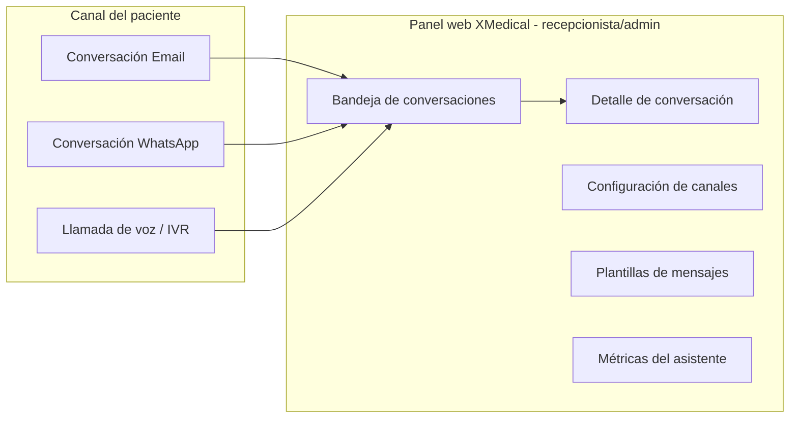

# 3. DISEÑO UI/UX
## Módulo: Recepción Virtual Omnicanal (XMedical)

| Versión | Fecha | Autor | Estado |
|---------|-------|-------|--------|
| 0.1 | 2026-07 | Equipo XMedical | **Borrador** |

> Responde a **¿cómo se verá y cómo se usará?**. Este módulo tiene **dos superficies de UI**: (1) la **conversación** que ve el paciente en su canal (email/WhatsApp/voz) y (2) el **panel web** que usa el recepcionista dentro de XMedical. Se apoya en el [PRD](01%20PRD%20-%20Recepcion%20Virtual.md) y el [Flujo](02%20Flujo%20de%20la%20App%20-%20Recepcion%20Virtual.md).

---

## 1. Principios de diseño

- **Claro y breve:** mensajes cortos, una acción por mensaje, lenguaje sencillo.
- **Institucional:** tono formal-cordial; el bot se identifica como asistente de la clínica.
- **Consistente con XMedical:** el panel web reutiliza las plantillas y estilos actuales (server-side, mismo layout).
- **Accesible:** legible, con alternativas de texto en voz y compatible con lectores de pantalla en el panel.
- **Seguro por defecto:** nunca muestra datos clínicos sensibles por canales externos.
- **Con salida humana siempre visible:** el paciente siempre puede pedir "hablar con una persona".

---

## 2. Mapa de pantallas / superficies



### Pantallas del panel web (recepcionista/admin)

1. **Bandeja de conversaciones** — lista con filtros (canal, estado, sin asignar).
2. **Detalle de conversación** — hilo de mensajes + acciones (responder, cerrar, ver paciente/cita).
3. **Configuración de canales** — activar email/WhatsApp/voz, credenciales por institución, horario de atención.
4. **Plantillas de mensajes** — editor de recordatorio/confirmación (incluye estado de aprobación HSM para WhatsApp).
5. **Métricas** — resueltas por el bot, escaladas, tasa de confirmación, ausentismo.

---

## 3. Wireframes de baja fidelidad (panel web)

### 3.1 Bandeja de conversaciones

```
┌──────────────────────────────────────────────────────────────┐
│ XMedical ▸ Recepción Virtual                     [Clinica Demo]│
├──────────────────────────────────────────────────────────────┤
│ Filtros: [Canal ▾] [Estado ▾] [Buscar paciente...      🔍]     │
├──────────────────────────────────────────────────────────────┤
│ ● WhatsApp │ Juan Pérez     │ "Quiero cancelar..." │ Escalada  │
│ ○ Email    │ María López    │ "¿A qué hora es...?" │ Abierta   │
│ ● Voz      │ (sin identif.) │ Transcripción...     │ Nueva     │
│ ○ Email    │ Ana Torres     │ "Confirmo mi cita"   │ Cerrada   │
├──────────────────────────────────────────────────────────────┤
│                                          [Ver más ▾]           │
└──────────────────────────────────────────────────────────────┘
```

### 3.2 Detalle de conversación

```
┌──────────────────────────────────────────────────────────────┐
│ ◀ Volver   Juan Pérez · WhatsApp · Escalada     [Ver paciente]│
├──────────────────────────────────────────────────────────────┤
│  Paciente: Hola, necesito cancelar mi cita del jueves         │
│  Bot: Encontré tu cita del 09/07 10:00 con Medicina General.  │
│       ¿Confirmas que deseas cancelarla? (sí/no)               │
│  Paciente: sí                                                  │
│  [Sistema] Confianza baja → escalado a humano                 │
├──────────────────────────────────────────────────────────────┤
│  Escribir respuesta...                              [Enviar]   │
│  Acciones: [Cancelar cita] [Reprogramar] [Cerrar conversación]│
└──────────────────────────────────────────────────────────────┘
```

---

## 4. Diseño para computadora y móvil

- **Panel web:** responsivo (mismo enfoque que el resto de XMedical). En móvil, la bandeja y el detalle se apilan (una columna); en escritorio, dos columnas (lista + detalle).
- **Canal del paciente:** la UI la provee el propio canal (cliente de correo, app de WhatsApp, teléfono). El diseño aquí es el **copy** y la estructura de los mensajes, no pantallas propias.

---

## 5. Componentes reutilizables

| Componente | Uso |
|------------|-----|
| Tabla/lista con filtros | Bandeja de conversaciones |
| Tarjeta de conversación | Ítem de la bandeja (canal, paciente, último mensaje, estado) |
| Hilo de mensajes (burbujas) | Detalle de conversación |
| Badge de estado | nueva / abierta / escalada / cerrada |
| Badge de canal | email / whatsapp / voz |
| Editor de plantilla | Configuración de plantillas |
| Botones de acción | confirmar / cancelar / reprogramar / cerrar |
| Alertas/toasts | éxito, error, información |

---

## 6. Estados especiales

| Estado | Panel web | Canal del paciente |
|--------|-----------|--------------------|
| **Carga** | Skeleton en bandeja/hilo | "Estoy revisando tu información…" |
| **Vacío** | "No hay conversaciones" | — |
| **Error** | Toast "No se pudo cargar/enviar" | "Tuvimos un problema, te comunico con una persona." |
| **Éxito** | Toast "Cita cancelada" | "Listo, tu cita fue cancelada ✅" |
| **Sin conexión / proveedor caído** | Aviso en cabecera | Reintento automático + fallback a humano |
| **No identificado** | Marca "sin identificar" | "Para ayudarte, ¿me confirmas tu documento?" |

---

## 7. Reglas de accesibilidad

- Contraste AA en el panel; no depender solo del color para el estado (usar texto + ícono).
- Navegación por teclado y foco visible en la bandeja/detalle.
- Etiquetas ARIA en botones de acción.
- En voz: hablar claro y pausado, ofrecer repetición ("¿deseas que lo repita?") y opción "marca 0 para un asesor".
- Textos simples (nivel de lectura básico), sin jerga médica.

---

## 8. Textos importantes (copy base, español LatAm)

| Situación | Texto propuesto |
|-----------|-----------------|
| Saludo / identificación | "Hola, soy el asistente de {clínica}. ¿En qué puedo ayudarte?" |
| Recordatorio | "Te recordamos tu cita el {fecha} a las {hora} con {médico}. Responde CONFIRMO o CANCELO." |
| Confirmación exitosa | "¡Gracias! Tu cita quedó confirmada. Te esperamos." |
| Cancelación exitosa | "Listo, cancelamos tu cita del {fecha}. Si deseas otra, escríbenos." |
| No entendido | "No estoy seguro de haber entendido. ¿Quieres que te comunique con una persona?" |
| Escalado | "Te estoy comunicando con nuestro equipo de recepción. En breve te atienden." |
| Fuera de alcance clínico | "No puedo dar información médica, pero puedo agendarte con un profesional." |
| Aviso de grabación (voz) | "Esta llamada puede ser grabada para mejorar la atención." |

---

## 9. Referencias

- [PRD — Recepción Virtual](01%20PRD%20-%20Recepcion%20Virtual.md)
- [Flujo — Recepción Virtual](02%20Flujo%20de%20la%20App%20-%20Recepcion%20Virtual.md)
- [Documento 4: Arquitectura de alto nivel](../4%20Documento%20Arquitectura%20de%20alto%20nivel.md)

---

**Fin del Diseño UI/UX — Recepción Virtual**
