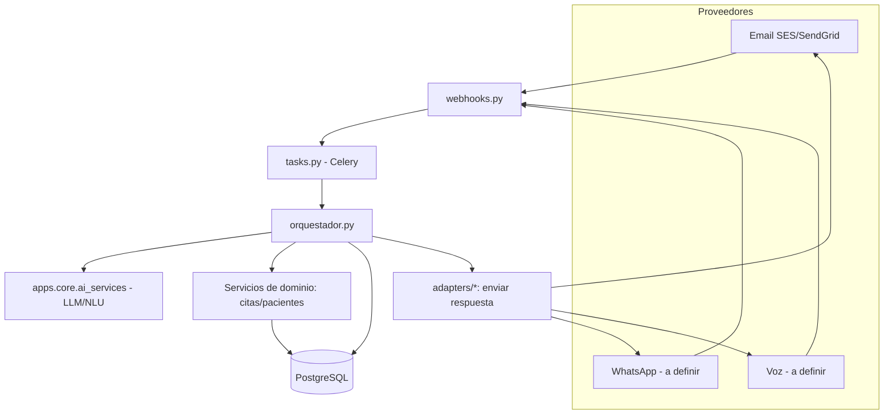
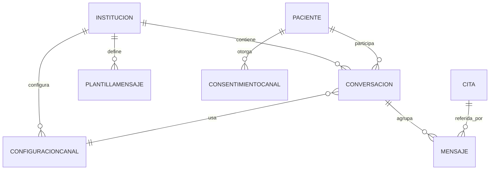

# 5. BACKEND Y ESQUEMA DE DATOS
## Módulo: Recepción Virtual Omnicanal (XMedical)

| Versión | Fecha | Autor | Estado |
|---------|-------|-------|--------|
| 0.1 | 2026-07 | Equipo XMedical | **Borrador** |

> Responde a **¿cómo se guardan y procesan los datos?**. Define arquitectura interna, entidades, modelo de datos, API, reglas y procesos. Se apoya en el [TRD](04%20TRD%20-%20Recepcion%20Virtual.md).

---

## 1. Arquitectura general



---

## 2. Módulos del backend (app `apps/recepcion_virtual/`)

| Módulo | Responsabilidad |
|--------|-----------------|
| `webhooks.py` | Endpoints entrantes; validan firma y encolan en Celery |
| `tasks.py` | Tareas Celery: procesar entrante, enviar saliente, recordatorios programados |
| `orquestador.py` | Resolver tenant/paciente, clasificar intención, ejecutar acción, generar respuesta |
| `intents.py` | Catálogo de intenciones y mapeo a acciones de dominio |
| `adapters/base.py` | Interfaz `CanalAdapter` (`recibir()`, `enviar()`) |
| `adapters/email.py`, `whatsapp.py`, `voz.py` | Implementaciones por proveedor |
| `models.py` | Entidades del módulo |
| `services.py` | Lógica de conversación reutilizable |
| `admin.py` | Gestión en Django admin |

---

## 3. Entidades principales

| Entidad | Datos principales |
|---------|-------------------|
| ConfiguracionCanal | institución, canal, proveedor, identificador, credenciales(ref), activo |
| Conversacion | institución, paciente, canal, externo_id, estado, fechas |
| Mensaje | conversación, dirección, contenido, intención, metadatos, fecha |
| PlantillaMensaje | institución, canal, clave, contenido, aprobada_proveedor |
| ConsentimientoCanal | paciente, canal, estado(opt-in/out), fecha |

Entidades existentes reutilizadas: `Institucion`, `Paciente`, `Cita`, `Profesional` (de las apps actuales).

---

## 4. Modelo de datos (relaciones)



---

## 5. Tablas (borrador de modelos Django)

```python
class ConfiguracionCanal(models.Model):
    institucion = models.ForeignKey("core.Institucion", on_delete=models.CASCADE)
    canal = models.CharField(max_length=20)          # email|whatsapp|voz|sms
    proveedor = models.CharField(max_length=40)      # ses|meta_cloud|twilio|vapi...
    identificador = models.CharField(max_length=120) # nº, email o phone_id
    credenciales = models.JSONField(default=dict)    # referencia a secreto, NO claves en claro
    horario_atencion = models.JSONField(default=dict)
    activo = models.BooleanField(default=True)

class ConsentimientoCanal(models.Model):
    paciente = models.ForeignKey("pacientes.Paciente", on_delete=models.CASCADE)
    canal = models.CharField(max_length=20)
    estado = models.CharField(max_length=10, default="opt_in")  # opt_in|opt_out
    fecha = models.DateTimeField(auto_now=True)

class Conversacion(models.Model):
    institucion = models.ForeignKey("core.Institucion", on_delete=models.CASCADE)
    paciente = models.ForeignKey("pacientes.Paciente", null=True, on_delete=models.SET_NULL)
    canal = models.CharField(max_length=20)
    externo_id = models.CharField(max_length=120, db_index=True)  # idempotencia
    estado = models.CharField(max_length=20, default="abierta")   # nueva|abierta|escalada|cerrada
    creada = models.DateTimeField(auto_now_add=True)
    actualizada = models.DateTimeField(auto_now=True)

class Mensaje(models.Model):
    conversacion = models.ForeignKey(Conversacion, on_delete=models.CASCADE, related_name="mensajes")
    direccion = models.CharField(max_length=10)      # entrante|saliente
    contenido = models.TextField()
    intencion = models.CharField(max_length=40, blank=True)
    confianza = models.FloatField(null=True)
    metadatos = models.JSONField(default=dict)       # audio_url, tokens, proveedor...
    creado = models.DateTimeField(auto_now_add=True)

class PlantillaMensaje(models.Model):
    institucion = models.ForeignKey("core.Institucion", on_delete=models.CASCADE)
    canal = models.CharField(max_length=20)
    clave = models.CharField(max_length=60)          # recordatorio_cita|confirmacion...
    contenido = models.TextField()                   # placeholders {{ }}
    aprobada_proveedor = models.BooleanField(default=False)  # HSM WhatsApp
```

---

## 6. API y endpoints

### 6.1 Webhooks entrantes (públicos, firmados)

```
POST   /recepcion/webhook/email/{institucion}      # inbound parse
POST   /recepcion/webhook/whatsapp/{institucion}   # mensajes WhatsApp
GET    /recepcion/webhook/whatsapp/{institucion}    # verificación (hub.challenge)
POST   /recepcion/webhook/voz/{institucion}         # eventos de llamada
```

### 6.2 Panel web (sesión Django, rol recepcionista/admin)

```
GET    /recepcion/conversaciones/                   # bandeja
GET    /recepcion/conversaciones/{id}/              # detalle
POST   /recepcion/conversaciones/{id}/responder/    # respuesta manual
POST   /recepcion/conversaciones/{id}/cerrar/       # cerrar
POST   /recepcion/conversaciones/{id}/accion/       # confirmar/cancelar cita
GET    /recepcion/config/canales/                   # configuración
GET    /recepcion/config/plantillas/                # plantillas
GET    /recepcion/metricas/                         # indicadores
```

> Si se implementa la [API REST del Doc 13](../13%20App%20movil%20y%20API%20REST.md), el orquestador debe reutilizar sus **servicios de dominio** (crear/cancelar cita) para no duplicar reglas.

---

## 7. Reglas de validación

- Verificar firma/token del webhook antes de crear registros.
- `externo_id` único por conversación → idempotencia ante reintentos.
- Paciente debe ser **titular** de la cita para modificarla.
- Respetar `horario_atencion` para envíos proactivos.
- Envíos por WhatsApp fuera de la ventana de 24 h → solo `PlantillaMensaje` con `aprobada_proveedor=True`.
- Validar consentimiento (`ConsentimientoCanal.estado == opt_in`) antes de contactar proactivamente.

---

## 8. Roles y permisos (backend)

- Endpoints de panel protegidos con `LoginRequiredMixin` + verificación de rol (`recepcionista`/`admin`).
- Webhooks sin sesión, protegidos por firma.
- Todas las consultas filtradas por `institucion_id` (aislamiento multi-tenant), coherente con `TenantMiddleware`/RLS existentes.

---

## 9. Procesos automáticos (Celery)

| Tarea | Frecuencia | Descripción |
|-------|-----------|-------------|
| `enviar_recordatorios` | Diaria (beat) | Citas de las próximas 24 h con consentimiento |
| `procesar_entrante` | Por evento | Orquesta un mensaje recibido |
| `enviar_saliente` | Por evento | Envía respuesta por el adaptador |
| `reintentar_envio` | Con backoff | Reintenta ante caída de proveedor |
| `cerrar_conversaciones_inactivas` | Diaria | Cierra hilos sin actividad tras N horas |

---

## 10. Integraciones externas

Detalle y opciones de proveedores en [Documento 15](../15%20Recepcion%20Virtual%20Omnicanal.md) (§6 email, §7 WhatsApp, §8 voz) y [Documento 9](../9%20Documento%20de%20integraciones.md). Cada adaptador normaliza el payload del proveedor a un formato interno común `{tenant, remitente, contenido, externo_id, adjuntos}`.

---

## 11. Manejo de errores

- Webhook responde **2xx rápido** aunque el procesamiento falle luego (se reintenta en Celery).
- Errores de negocio → mensaje claro al paciente + opción de escalar.
- Errores de proveedor → backoff + degradación (avisar a recepción).
- Todo error se registra con contexto (sin exponer secretos).

---

## 12. Auditoría y trazabilidad

- Cada `Mensaje` y acción de cita queda registrado con timestamp e institución.
- Cambios de estado de `Cita` originados por el bot se marcan como fuente "recepcion_virtual".
- Integración con el sistema de auditoría de `apps.core`.

---

## 13. Referencias

- [TRD — Recepción Virtual](04%20TRD%20-%20Recepcion%20Virtual.md)
- [Documento 6: Modelo de datos (global)](../6%20Documento%20Modelo%20de%20datos.md)
- [Documento 9: Integraciones](../9%20Documento%20de%20integraciones.md)
- [Documento 13: App móvil y API REST](../13%20App%20movil%20y%20API%20REST.md)
- [Documento 15: Recepción Virtual Omnicanal](../15%20Recepcion%20Virtual%20Omnicanal.md)

---

**Fin del Backend y Esquema de Datos — Recepción Virtual**
