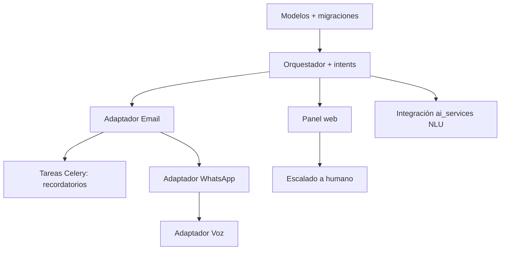

# 6. PLAN DE IMPLEMENTACIÓN
## Módulo: Recepción Virtual Omnicanal (XMedical)

| Versión | Fecha | Autor | Estado |
|---------|-------|-------|--------|
| 0.1 | 2026-07 | Equipo XMedical | **Borrador** |

> Responde a **¿en qué orden se construirá?**. Convierte los documentos anteriores en trabajo ejecutable: fases, prioridades, entregables, pruebas y despliegue. Se apoya en [PRD](01%20PRD%20-%20Recepcion%20Virtual.md), [TRD](04%20TRD%20-%20Recepcion%20Virtual.md) y [Backend/Esquema](05%20Backend%20y%20Esquema%20de%20Datos%20-%20Recepcion%20Virtual.md).

---

## 1. Alcance de la primera versión (MVP)

Canal **Email** con: identificación tenant/paciente, intenciones de **recordatorio/confirmación/cancelación**, **escalado a humano**, panel de conversaciones y auditoría. WhatsApp y voz quedan para fases posteriores (proveedores a definir).

---

## 2. Fases de desarrollo

| Fase | Entregable | Depende de |
|------|-----------|------------|
| 0. Descubrimiento | PRD, TRD, flujos, UI/UX, backend/esquema (estos documentos) | — |
| 1. Base técnica | App `apps/recepcion_virtual/`, modelos, migraciones, admin, orquestador base | Fase 0 |
| 2. MVP Email | Adaptador email (in/out), intents básicos, recordatorio/confirmación/cancelación | Fase 1 + proveedor email |
| 3. Panel web | Bandeja + detalle + acciones + escalado a humano | Fase 2 |
| 4. WhatsApp | Adaptador WhatsApp, plantillas HSM, agendamiento conversacional | Fase 3 + **proveedor WhatsApp** |
| 5. Voz | Adaptador voz (telefonía + STT + TTS), IVR simple | Fase 4 + **proveedor voz** |
| 6. Métricas y optimización | Indicadores (resolución, ausentismo, costos), ajustes de prompts | Fases 2–5 |
| 7. Producción | Despliegue por institución, monitoreo, soporte | Fase correspondiente |

---

## 3. Módulos por implementar y dependencias

- **Prerrequisito recomendado:** extraer/usar **servicios de dominio** compartidos para citas (o la [API REST Doc 13](../13%20App%20movil%20y%20API%20REST.md)) antes de la Fase 2.

---

## 4. Priorización

Sigue la tabla de prioridades del [PRD §12](01%20PRD%20-%20Recepcion%20Virtual.md): Email y núcleo (Alta) → WhatsApp (Media) → Voz (Baja).

---

## 5. Entregables por fase

| Fase | Entregables verificables |
|------|--------------------------|
| 1 | Migraciones aplicadas; entidades en admin; tests de modelos |
| 2 | Recibir/enviar email real; recordatorio programado; confirmación/cancelación funcionando |
| 3 | Recepcionista ve y atiende conversaciones; handoff operativo |
| 4 | Conversación WhatsApp end-to-end con plantillas aprobadas |
| 5 | Llamada de voz que confirma/consulta cita |
| 6 | Dashboard de métricas |

---

## 6. Pruebas

| Tipo | Alcance |
|------|---------|
| Unitarias | Orquestador, intents, validaciones, modelos |
| Integración | Webhooks (firma, idempotencia), adaptadores con proveedor sandbox |
| Extremo a extremo | Recordatorio→confirmación; cancelación; escalado |
| Seguridad | Verificación de firma, aislamiento por tenant, minimización de datos |
| Carga | Envío masivo de recordatorios; concurrencia de webhooks |
| UAT | Recepcionistas reales en una clínica piloto |

Reutilizar la suite Django (`run_tests.sh`) y el marco de pruebas existente ([Documento 10](../10%20Plan%20de%20Pruebas.md)).

---

## 7. Criterios de aceptación (Definition of Done)

- **"Confirmar cita"** está terminada cuando: el paciente responde por su canal; el sistema verifica que es el titular; actualiza `Cita.estado=confirmada`; envía acuse; y registra la acción en auditoría.
- **"Cancelar cita"**: además libera el cupo del horario.
- **"Escalado a humano"**: la conversación aparece en el panel con el historial completo y un recepcionista puede responder.
- Toda función incluye pruebas automatizadas y respeta el aislamiento por tenant.

---

## 8. Riesgos

| Riesgo | Mitigación |
|--------|------------|
| Elección tardía de proveedor WhatsApp/voz | Adaptadores desacoplados; empezar por Email |
| Costos de voz elevados | Limitar voz a casos de alto valor; fallback a mensaje |
| Requisitos de Meta (plantillas/verificación) | Iniciar verificación de negocio temprano |
| Calidad de NLU en español | Ajuste de prompts + umbral de confianza + escalado |
| Datos sensibles por canales externos | Minimización + consentimiento + auditoría |
| Falsos positivos de identificación | Verificación por documento; escalado ante duda |

---

## 9. Plan de despliegue

- Activación **por institución** (feature flag / `ConfiguracionCanal.activo`).
- Piloto con una clínica antes del despliegue general.
- Coherente con el [Documento 11: Plan de Despliegue](../11%20Plan%20de%20Deespliegue.md) (Apache → Gunicorn → Django; Celery worker + beat).
- Variables de entorno y secretos configurados por institución (ver [TRD §7](04%20TRD%20-%20Recepcion%20Virtual.md)).

---

## 10. Capacitación y manuales

- Guía para recepcionistas: uso del panel, cuándo interviene el bot, cómo retomar conversaciones.
- Guía para administradores: activar canales, editar plantillas, definir horario de atención.
- Mensaje inicial de opt-in explicado a los pacientes.

---

## 11. Mantenimiento inicial

- Monitoreo de tasa de escalado y errores por canal.
- Revisión periódica de prompts y plantillas.
- Control de costos por proveedor y por institución.
- Ajuste del umbral de confianza según resultados.

---

## 12. Referencias

- [PRD — Recepción Virtual](01%20PRD%20-%20Recepcion%20Virtual.md)
- [Flujo — Recepción Virtual](02%20Flujo%20de%20la%20App%20-%20Recepcion%20Virtual.md)
- [Diseño UI/UX — Recepción Virtual](03%20Diseno%20UI-UX%20-%20Recepcion%20Virtual.md)
- [TRD — Recepción Virtual](04%20TRD%20-%20Recepcion%20Virtual.md)
- [Backend y Esquema — Recepción Virtual](05%20Backend%20y%20Esquema%20de%20Datos%20-%20Recepcion%20Virtual.md)
- [Documento 10: Plan de Pruebas](../10%20Plan%20de%20Pruebas.md)
- [Documento 11: Plan de Despliegue](../11%20Plan%20de%20Deespliegue.md)
- [Documento 12: Sprint backlog](../12%20Sprint%20backlog.md)

---

**Fin del Plan de Implementación — Recepción Virtual**
